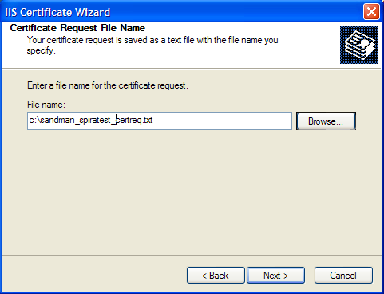

# Appendix B -- Using with SSL

This section outlines how you can install a Secure Sockets Layer (SSL)
certificate onto IIS to allow users to access KronoDesk® via an
encrypted protocol, so that usernames, passwords and sensitive project
data cannot be "sniffed" across the network. This is especially
important if your web-server is being accessed across the Internet.

This section assumes that you already have a Certificate Authority (CA)
available to generate an SSL certificate for you. This can either be a
third-party provider (e.g. Verisign) or a tool used to generate "self
certificates" that can be used internally to your organization. For more
information on the differences between these two options, please read
the following documents:

<http://www.microsoft.com/technet/prodtechnol/WindowsServer2003/Library/IIS/8d3bb71a-0a7f-443f-8084-908d0dab9caa.mspx?mfr=true>
(installing self or third-party certificate on Windows Server 2003)

<http://www.somacon.com/p42.php> (installing self-certificate on Windows
XP)

Once you have decided how you will generate the certificate, you next
need to generate the request for the certificate from your web server.
First, click Start \> Settings \> Control Panel \> Administrative Tools
\> Internet Information Services to bring up the IIS management console:

Now, right-click on the "Default Web Site" and choose "Properties", then
click the "Directory Security" tab:

Now, click the button marked "Server Certificate", click <Next\> and
choose the option marked "Create a new certificate", and click <Next\>.
You can then choose to either prepare the certificate request and sent
it later, or to send the certificate request immediately to an online
CA. If you are using a third-party CA and are connected to the Internet
choose the second option, otherwise choose the first option.

Enter the name for the certificate, typically this will contain the name
of the organization, purpose of the certificate and any other pertinent
information that will help you distinguish it.

You should choose a bit-length of at least 2048 bits, and leave the
other options unchecked unless you are using the server outside of the
United States, in which case you will need to choose the "Server Gated
Cryptography (SGA)" option. Click the <Next\> button when you are
finished.

Now enter the organization and organizational unit name that best
describes who is requesting the certificate. Click <Next\> when you are
finished.

Next enter the "common name" for the web site that will be using the
certificate. For a website that will be accessed across the Internet,
this should the fully qualified domain name (e.g.
[www.mysite.com](http://www.mysite.com/)), whereas for a website that is
limited to a local intranet, the computer name will suffice (e.g.
myhost). Click <Next\> when you are finished.

Next enter the country / region, state / province and city / locality
that best describe where the web-server will operate or where the
organizational entity resides. Once you are finished, click <Next\>.

Next, enter the filename that you want to use for the *certificate
request file*. This is the file that you will send to the Certificate
Authority (CA) to request an SSL certificate. This filename should be
memorable and describe what the certificate is for. The file extension
should be .txt. Click <Next\> once you have finished entering the
filename.

Finally, you will get a confirmation screen that verifies the
information you have entered. If you want to make changes, click the
<Back\> button, otherwise click <Next\> to actually generate the
certificate. Once finished, you will now have the certificate request
file that you can send to the Certificate Authority (CA) to process your
request.

Once the CA has processed your request, they will send back the actual
SSL certificate that you can install onto your web-sever. The next steps
will describe how to install the certificate once you receive it back
from the CA.

Once you have received the SSL certificate back from the CA, save the
file onto your hard-disk with the file-extension .cer. Now open up the
IIS management console (as described above), right-click on the "Default
Web Site" icon and choose "Properties". Now select the "Directory
Security" tab, and click the button marked <Server Certificate\> under
the heading "Secure Communications". When the dialog box appears, choose
the second option -- to process an existing request. This will bring up
the following dialog box:

Now, browse to the place on your hard disk where you saved the SSL
certificate (with extension .cer) and select the file you saved. Click
<Next\> to load the certificate. Once the certificate has been loaded,
all that remains is to tell IIS to require a secure HTTPS connection, so
that users don't attempt to access the website over the unencrypted HTTP
protocol.

From the IIS properties dialog box, click the button marked <Edit\>
under the "Secure Communications" heading:

Check the box marked "Require secure channel (SSL)", and click the
<OK\> button. You have now successfully configured IIS for secure HTTPS
data transmission.

