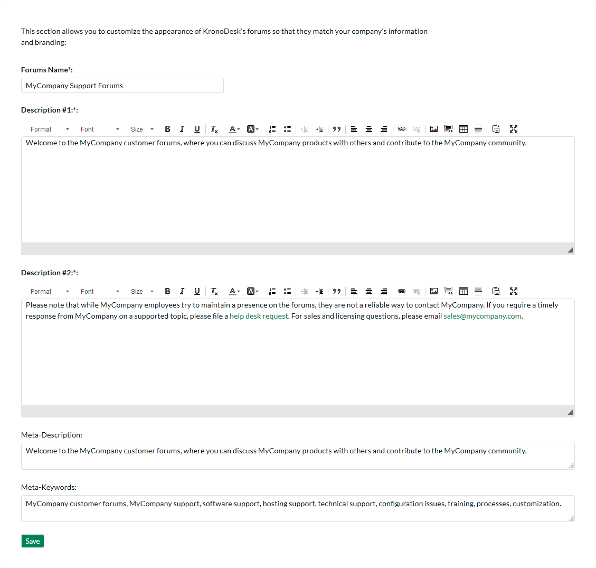
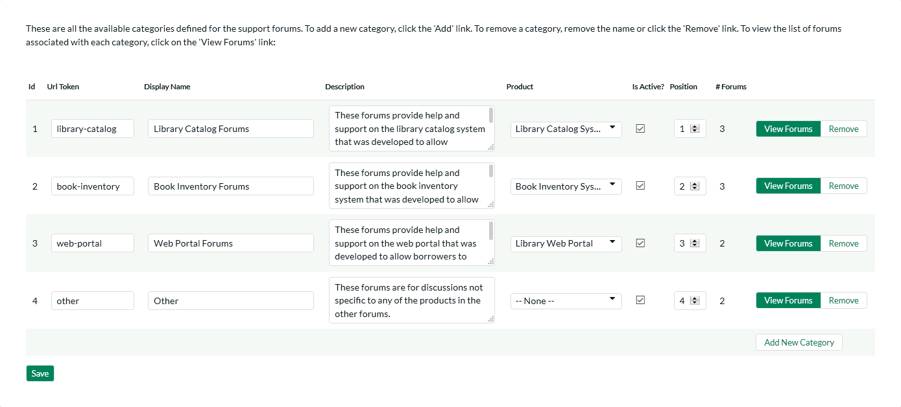
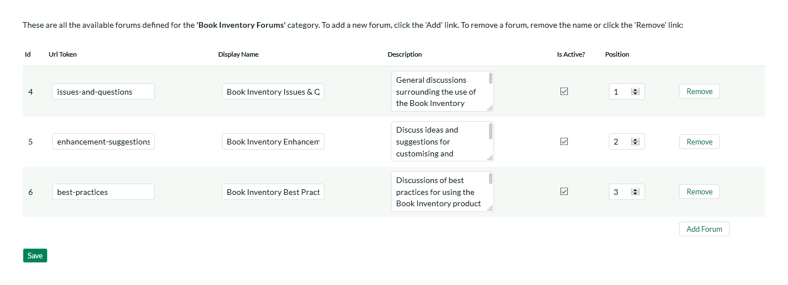

# Forum Settings

This section contains all of the settings that affect the customer
support forums part of the application.

## Appearance

This page allows an administrator to customize the appearance of the
customer support forums so that the standard text that is displayed
matches the support policies of the organization. It also allows the
administrator to customize some of the web page meta-data fields that
can be used to optimize the support forums for Search Engine
Optimization (SEO).

This page lets you specify the following values:

-   **Forums Name** -- You can change the title displayed for the online
support forums to match your company's name. For example you might
want to rename the forums "Acme Inc. Support Forums".

-   **Description \#1** -- This rich text box contains the first
paragraph of introductory text displayed on the support forums home
page.

-   **Description \#2** -- This rich text box contains the second
paragraph of introductory text displayed on the support forums home
page.

-   **Meta-Description** -- This plain text box contains the HTML
Meta-Description field that is not displayed in the web browser, but
is often used by search engines to rank the content. You may want to
modify this to ensure that your support forums are ranked highly on
Internet search engines. It should contain a brief description of
your company, its products, and the support forums

-   **Meta-Keywords** -- This plain text box contains the HTML
Meta-Keywords field that is not displayed in the web browser, but is
often used by search engines to rank the content. You may want to
modify this to ensure that your support forums are ranked highly on
Internet search engines. It should contain a comma-separated list of
keywords related to your company and products/services.

## Categories & Forums

This page lets administrators manage the different categories and forums
used in the KronoDesk customer support forums. The customer forums are
divided up into categories and each category has a set of forums.
Typically the forum categories are associated with a particular product
or service, although there may be some general categories that are
product agnostic.

When you first open this page, the system will list all the forum
categories already in the system. You can use this page to perform the
following operations:

-   **Modify an Existing Category** -- to do this, you simply need to
update the URL-Token, Display Name, Description, Product, Active
flag and Position value for the category and click \[Save\].

-   **URL Token** -- This is the URL segment that will be used to
create the hyperlink to access this forum category (e.g.
<http://myserver/KronoDesk/Forum/url-token.aspx>). Url Tokens
have to be unique and can only contain alphanumeric characters
and hyphens.

-   **Display Name** -- This is the name of the category that will
be displayed in the category details page.

-   **Description** -- This is the long description of the category
that will be displayed in the category details page.

-   **Product** -- If the category is related to a specific product,
you should select the product.

-   **Active** -- This should be checked if you want the category to
be visible within the application. Old categories that are no
longer in use should be made inactive.

-   **Position** -- This should be used to specify the order of the
categories.

-   **Create a New Category** -- to this, you simply need to click on
the "Add New Category" hyperlink in the bottom row and then enter
the new category information and click \[Save\].

-   **Delete an Existing Category** -- to do this, simply click on the
"Remove" hyperlink next to the category. You will be asked to
confirm the deletion, after which the category will be deleted from
the system. *Note: If you delete a forum category, the system will
delete all the forums, threads and message contained within that
category.*

To view the list of forums associated with a particular category, you
should click on the "View Forums" link that will display the appropriate
list of forums:

You can use this page to manage the various forums in the category:

-   **Modify an Existing Forum** -- to do this, you simply need to
update the URL-Token, Display Name, Description, Active flag and
Position value for the forum and click \[Save\].

-   **URL Token** -- This is the URL segment that will be used to
create the hyperlink to access this forum (e.g.
<http://myserver/KronoDesk/Forum/category/url-token.aspx>). Url
Tokens have to be unique for the specific category and can only
contain alphanumeric characters and hyphens.

-   **Display Name** -- This is the name of the forum.

-   **Description** -- This is the long description of the forum
that will be displayed in the forum details page.

-   **Active** -- This should be checked if you want the forum to be
visible within the application. Old forum that are no longer in
use should be made inactive.

-   **Position** -- This should be used to specify the order of the
forums in the category.

-   **Create a New Forum** -- to this, you simply need to click on the
"Add Forum" hyperlink in the bottom row and then enter the new forum
information and click \[Save\].

-   **Delete an Existing Forum** -- to do this, simply click on the
"Remove" hyperlink next to the forum. You will be asked to confirm
the deletion, after which the forum will be deleted from the system.
*Note: If you delete a forum, the system will delete all the threads
and message contained within that forum.*

