# Help Desk Settings

This section contains all of the settings that affect the help desk
ticketing part of the application.

## Custom Fields

Tickets in the Help Desk system can have up to 20 custom fields. There
are different types of custom fields allowed:

-   **Text**: Normal or Rich-Text field.

-   **Integer**: Whole-Number entry.

-   **Decimal**: Fractional number entry (currency, etc.)

-   **Boolean**: Simple yes/no (on/off) checkbox.

-   **Date**: Date selector.

-   **List**: Custom List selector.

-   **Multi-List**: Custom List selector that allows multiple values.

-   **User**: List of assignable users.

Each custom field can have optional settings applied to it. Optional
settings are as follows. (Note that not all settings are available for
all field types.)

-   **Default**: The default value when a new ticket is opened up.

-   **Precision**: How many decimal places is allowed (or the value is
rounded to).

-   **Minimum Value**: The minimum value allowed.

-   **Maximum Value**: The maximum value allowed.

-   **Minimum Length**: The minimum length of the data required in the
field.

-   **Maximum Length**: The maximum length of the data allowed in the
field.

-   **Rich Text**: Whether or not the text field allows HTML or not.

-   **Custom List**: The defined Custom List for the field that users
can select from.

Going to the main page, you will see a list of custom field defined for
Tickets:

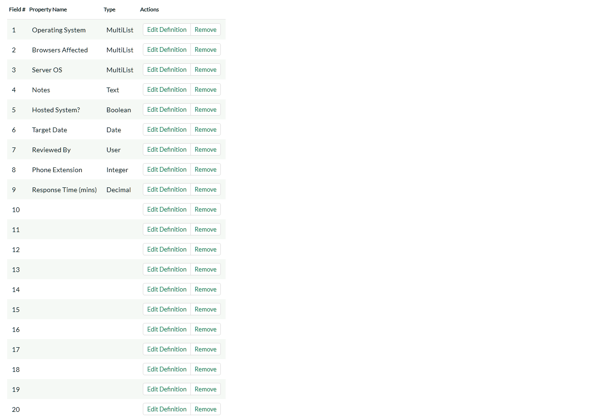

To edit a definition, click the Edit Definition link on a field, and you
will get a popup:

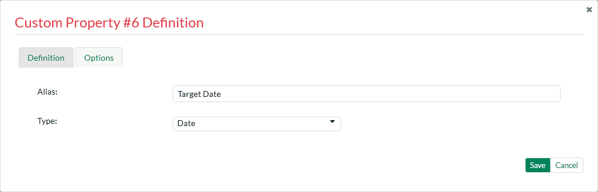

The fields visible will vary depending on the type of custom field you
have selected, but every custom field will need to have an Alias and a
Type. The Alias is what is shown to the user when viewing or editing the
ticket. The type is the type of data the ticket allows.

Under the Options tab will be available options that can be set for the
custom field.

When finished, click the 'Save' button and you will be returned to the
Custom Field list.

***Important Note:*** When changing a custom field's type or removing a
field, the data is not actually removed from the ticket. Therefore, if
you change a custom field of a date into a text, the field will display
the old date value until it is changed by the user.

## Ticket Statuses

Ticket statuses can be edited using the grid that displays all defined
statuses.

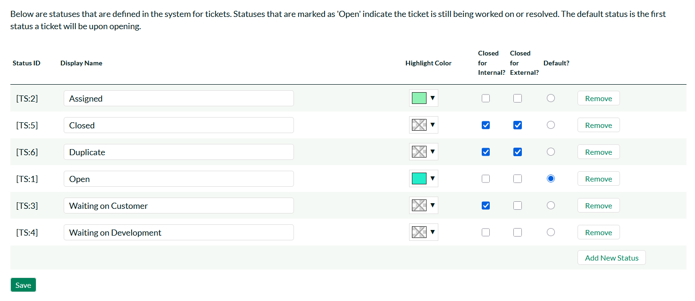

All statuses must have a display name, which is viewed by the user
editing or viewing the ticket. The other fields are:

- **Highlight Color** - you can optionally add a background color to the statuses when displayed in the ticket grid. This can be useful to highlight certain statuses that need urgent action.

-   **Closed for Internal?** - Whether this status is considered as
inactive for internal users (employees, support agents, etc.). For
example the sample status 'Waiting on Customer' would be considered
'Closed for Internal' because customer support agents do not want to
see such tickets in their list when it's waiting for a customer to
respond.

-   **Closed for External** - Whether this status is considered as
inactive for external users (customers, etc.). For example the
sample status 'Waiting on Customer' would be considered 'Open for
External' because end users / customers would definitely want to see
such tickets in their list since the support agent is waiting for
their response.

-   **Default?** - The status selected as the default is the status that
new tickets are opened as.

To add a new Status, click the Add New Status link -- a new row will be
inserted into the table where you can save the new status.

To remove a status, click the Remove link. Any tickets with a status
that has been removed will stay that status, until the next time a user
edits the ticket.

In addition to this screen that lets you edit the ticket statuses, if
you click on the "Advanced" option in the left hand navigation, it will
bring up the screen that lets you specify some additional status change
rules:

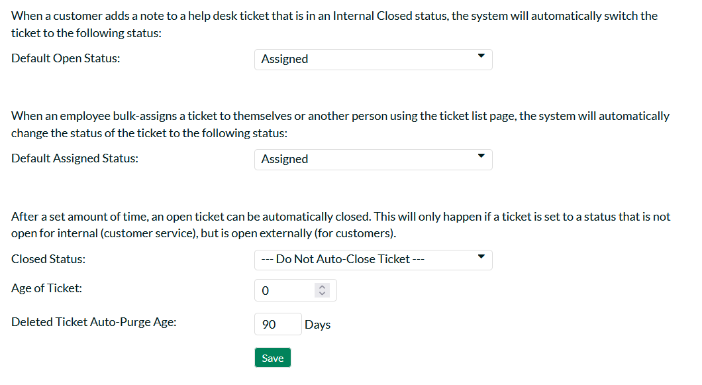

There are several options you can configure:

-   **The Default Open Status** -- this allows you to specify the status
that a ticket will be automatically switched to when a new note is
added by the person who originally opened the ticket. This is useful
when a customer accesses one of their existing tickets that's in a
closed status but forgets to change the status back to an open
status. This ensures that such tickets do not get forgotten about.

-   **The Default Assigned Status** -- this allows you to specify the
status that a ticket will be automatically switched to when you use
the bulk assign tools on the main Help Desk page. For example five
new tickets arrive and you select them and choose the option to
"Assign Tickets to Me". When they are assigned in this way, the
system will automatically change their status to the default
assigned status option (if specified).

-   **Closed Status** -- After a set amount of time, an open ticket can
be automatically closed. This will only happen if a ticket is set to
a status that is not open for internal (customer service), but is
open externally (for customers). The dropdown list contains the
status that the ticket will be switched to.

-   **Age of Ticket** - Allowable values: 7-365. After the ticket is
this number of days old, the status will be automatically
closed.

- **Deleted Ticket Auto-Purge Age** - this setting determines how long deleted tickets remain in the system before they are automatically purged. To retain all tickets and prevent auto-purging, enter `0` as the value.

## Ticket Types

The Ticket Type page defines values allowed for the standard Type field
for tickets. Types must have a unique display name, which is what the
user sees when they view or edit a type.

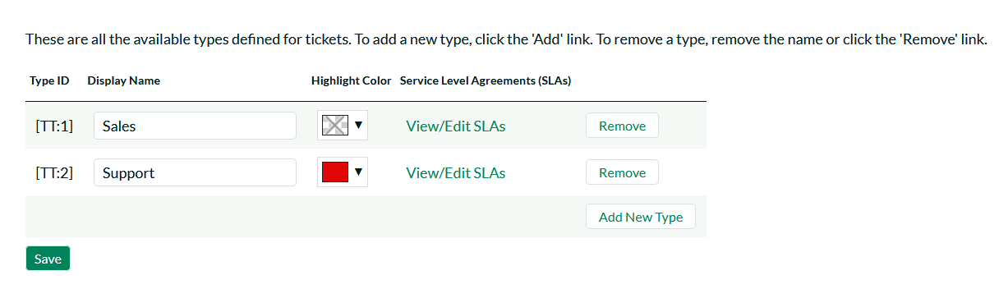

All types must have a display name, which is viewed by the user
editing or viewing the ticket. The other fields are:

- **Highlight Color** - you can optionally add a background color to the types when displayed in the ticket grid. This can be useful to highlight certain types that typically need more attention.

To add a new type, click the `Add New Type` link, and fill out the new
empty row.

KronoDesk allows you to define **SLAs** with each ticket type. To view/edit the SLA, click on the `View/Edit SLAs` link. You can learn more about SLAs by refering to the [Managing SLAs section](#ticket-slas).

To remove a type, click the `Remove` button to the right of the defined
type. Note that any tickets assigned to a type that is removed will
retain their type, until the next time a user tries to edit the ticket.

## Ticket Priorities

The Ticket Priorities page defines values allowed for the standard
Priority field. Like types, priorities must have a unique name.

To add a new priority, click the Add New Priority link, and fill out the
new empty row.

To remove a priority, click the Remove button to the right of the
priority. Note that any tickets assigned to a priority that is removed
will retain their value, until the next time a user tries to edit the
ticket. Colors assigned to the priority will appear in the Ticket List
page in the Priority column.

## Ticket Resolutions

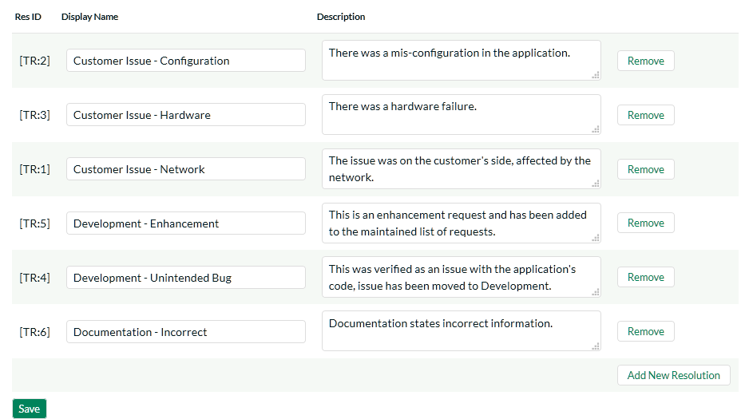

The Ticket Resolutions page defines values allowed for the standard
Resolution field. Like types and priorities, resolutions must have a
unique name. The description is used internally, and should just contain
a short summary of the meaning of the resolution.

To add a new resolution, click the Add New Resolution link, and fill out
the new empty row.

To remove a resolution, click the Remove button to the right of the
resolution. Note that any tickets assigned to a resolution that is
removed will retain their value, until the next time a user tries to
edit the ticket.

## Ticket SLAs

This screen lets you define the different SLAs for the various ticket priorities for the current ticket type. KronoDesk lets you have a specific SLA for each combination of **ticket type** and **ticket priority**.

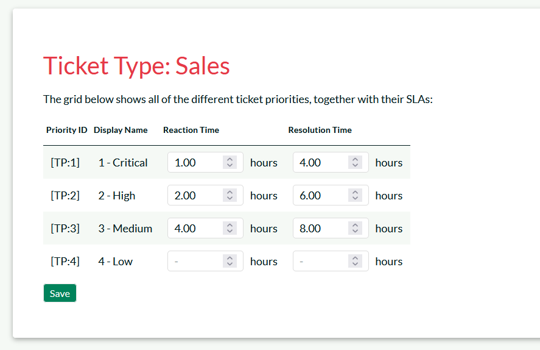

The two SLAs you can define per priority are:

- **Reaction Time**: This is the maximum allowed time from when a ticket was first logged by the customer, to when either the ticket was assigned or an initial holding response was given to the customer. The SLA excludes any time outside of the defined working hours (see next section).
- **Resolution Time**: This is the maximum allowed time from when a ticket was first logged by the customer, to when the ticket is resolved. It excludes any time when the ticket was waiting on the customer for a response.

*Note: if you leave either reaction or resolution time blank for a specific priority, KronoDesk will assume there is no defined SLA.**

### Viewing Ticket SLAs

When you display the list of tickets, you can choose to show the special **ticket SLA** columns:

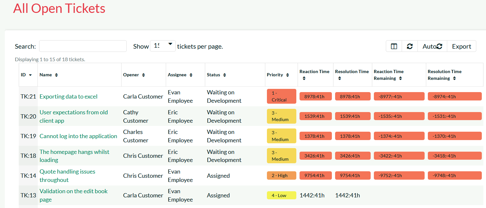

The following columns are available:

- **Reaction Time**: This is the amount of working time spent so far on the specific ticket prior to it being assigned or reacted to. If the time spent has exceed the SLA, the time will shown with a red background.
- **Reaction Time Remaining**: This is the amount of time remaining on this ticket before the reaction time SLA is breached. If breached, the time will become negative and the background will be shaded red.
- **Resolution Time**:  This is the amount of working time spent so far on the specific ticket prior to it being resolved. If the time spent has exceed the SLA, the time will shown with a red background. 
- **Resolution Time Remaining**: This is the amount of time remaining on this ticket before the resolution time SLA is breached. If breached, the time will become negative and the background will be shaded red.

## Working Hours

KronoDesk lets you define the standard working hours, which are used when measuring times against the defined [SLAs](#ticket-slas).

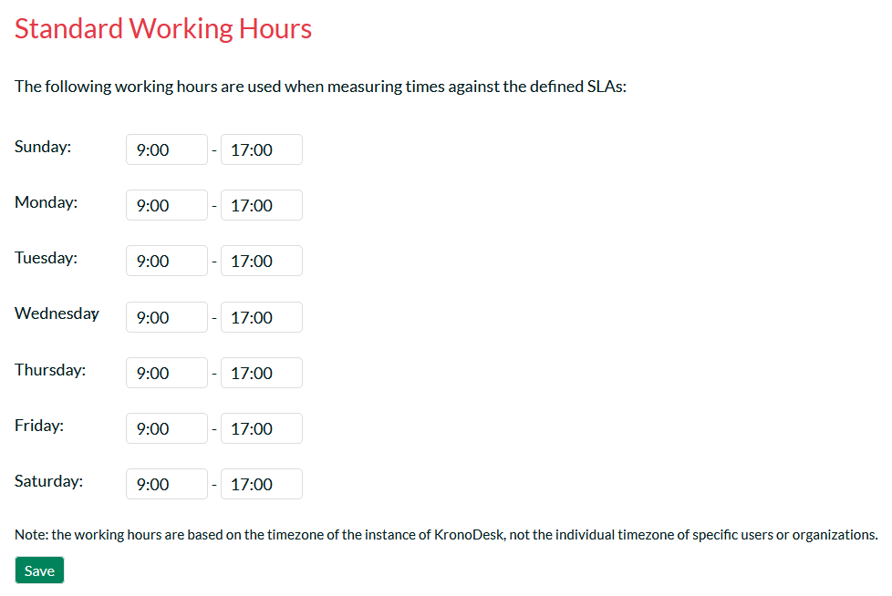

You specify the start and end time for each day of the week. If you leave the times blank for that day, it's considered a non working day (e.g. Saturday and Sunday would be left blank if weekends are considered non-working days).

*Note: the working hours are based on the timezone of the instance of KronoDesk, not the individual timezone of specific users or organizations.*

To account for public holidays and other special non-working days, there is an additional section below:

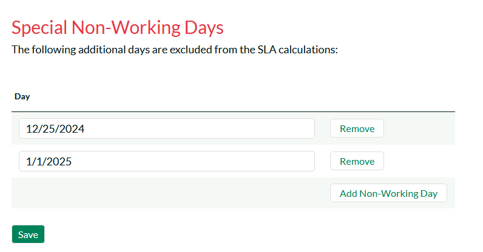

You can add any special one-off days in this section, which are also considered non-working.

## Spira Integration

When customer support agents work on tickets received from customers,
they may find that the issue is actually a product defect rather than a
customer support matter. In which case, they can take advantage of the
built-in integration with [SpiraTeam](http://inflectra.com/SpiraTeam)® -
Inflectra's award winning Application Lifecycle Management (ALM)
solution that has a powerful product incident management system.

KronoDesk® has the ability to connect to an instance of SpiraTeam® and
add new product incidents into the system that are linked to the
originating KronoDesk Ticket. That allows customer service agents to
monitor the status of the associated product incidents and inform
customers when the appropriate patches or fixes are available to correct
the problem.

This screen allows the administrator to setup the connection between
SpiraTeam and KronoDesk.

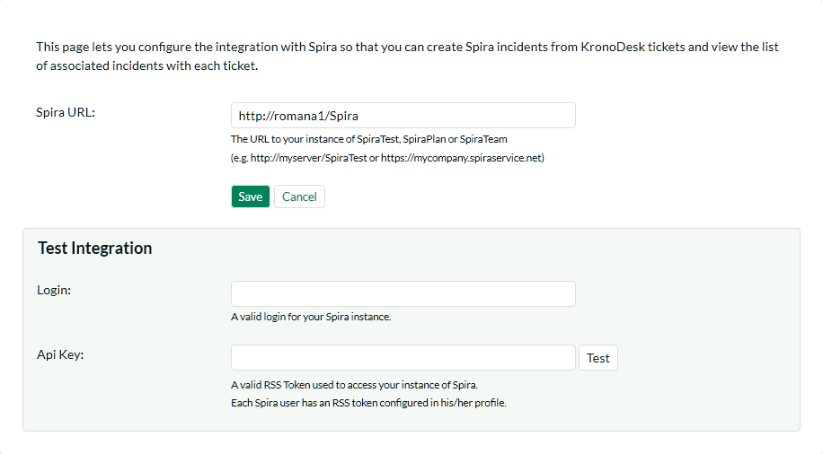

You should enter the URL that your users use to access their instance of
SpiraTest, SpiraPlan or SpiraTeam (including the HTTP or HTTPS prefix)
together with the SpiraTeam login and RSS Token for a valid SpiraTeam
user. The login and associated RSS Token is used to verify the
connection.

Once you have entered the information, you should click the \[Test\]
button to verify that the URL is accessible. If there are connectivity
issues, and error will be displayed, otherwise a green confirmation
message will appear. Once the connection information has been
successfully verified, you need to click the \[Save\] button to save the
connection settings in the system.

## Ticket Article Templates:

Templates can be created for quick replies to support tickets. This
allows for support agents to quickly respond to support tickets
referencing a related KB Article.

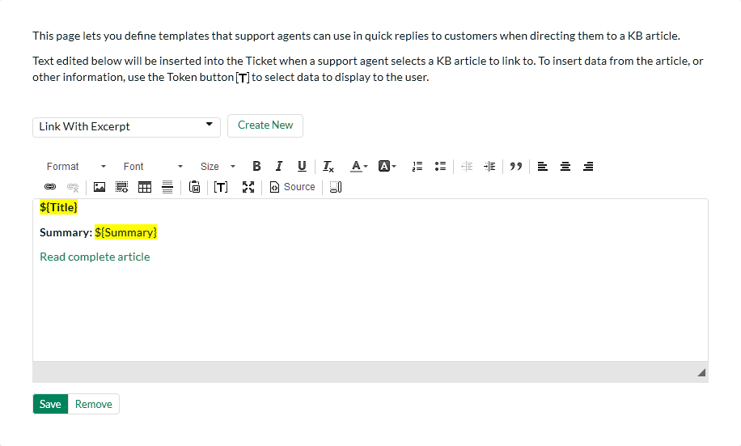

You can edit or create a new template, and to reference the selected KB
Article, you can use a set of templates, available in the (**\[T\]**)
toolbar button. The support agent can then select one of these templates
on the Ticket Details page, along with a KB article to insert into the
agent's reply.

