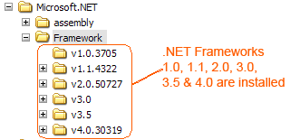
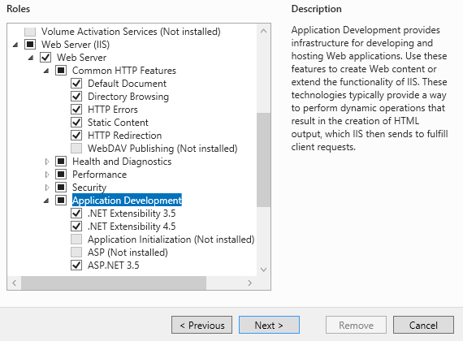
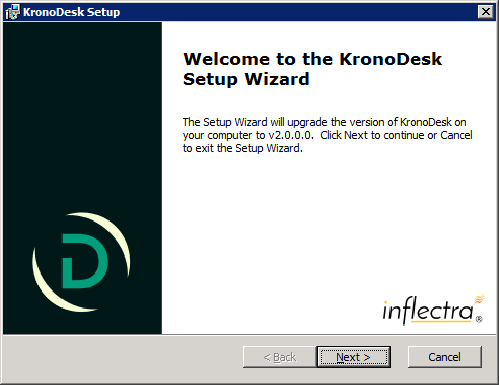
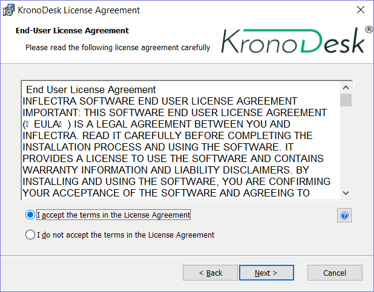
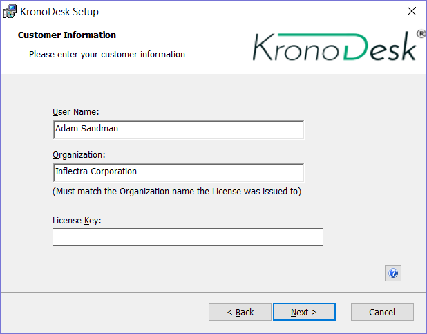
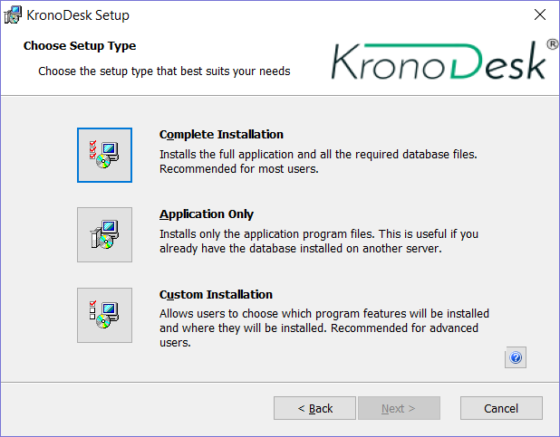
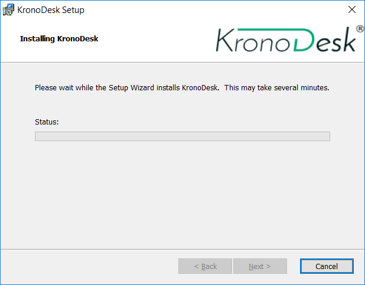
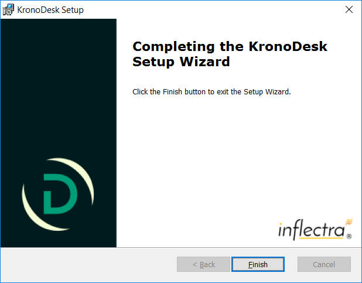

# Installing KronoDesk®

This section outlines how to prepare your system for installation of
KronoDesk®, how to actually install the software using the provided
installation package, and finally how to ensure that your web-server is
correctly configured to ensure secure operation.

The first sub-section will outline what hardware and software
configurations are supported and the exact installation sequence for
Windows 2012, 2008, 2003, 8, 7, Vista and Windows XP. The second
sub-section will explain how to load the KronoDesk® software onto the
server, and discuss common problems and solutions.

The minimum hardware and software requirements for running the
KronoDesk® system are:

| **Requirement**                   | **Minimum Specification**         |
| -------- | -------- | 
| **Server Requirements** | |
| **Processor:**                    | Intel® or AMD® x86 or x64 compatible processor              |
| **Memory:**                       | 8 GB recommended                  |
| **Database:**                     | Microsoft SQL Server 2017   Microsoft SQL Server 2016   Microsoft SQL Server 2014   Microsoft SQL Server 2012   Microsoft SQL Server 2008 R2   SQL Server Express is supported,   but not recommended for   production due to limitations.    |
| **Web Server:**                   | Internet Information Services  (IIS) 7.0 or higher   .NET 4.5.2 Framework or higher    |
| **Client Requirements**           |                                   |
| **Web Browser:**                  | Mozilla Firefox   Google Chrome (Desktop and Android)   Apple Safari (Desktop and iOS)   Microsoft Edge   Opera   Internet Explorer 11.0 (not recommended)                      |

\*Note that KronoDesk® can be loaded onto either Windows Server or
workstation editions, provided that the IIS web-server is installed and
that SQL Server is available as a database engine. However Windows
workstation editions can only support a maximum of 5 concurrent user web
sessions. In general unless there are only going to be a couple of
client machines hitting the server, we recommend using a Windows Server
OS.

# System Prerequisites

Assuming that you have already installed the appropriate version of
Microsoft Windows onto your computer (or that has been pre-installed for
you), you need to then make sure that the various prerequisites have
been correctly added to your installation before trying to install
KronoDesk®. The KronoDesk® installer will check to ensure that the
various prerequisites are in place, and will abort the installation if
any are missing, indicating to you what action needs to be taken.

We recommend that you install / configure the prerequisites in the
following order:

- Install the .NET Framework v4.5.2

- Install SQL Server 2008R2, 2012, 2014, 2016, or 2017.

- Install the latest version of Internet Explorer that your server OS
allows

- Ensure that IIS is installed

- Ensure that ASP.NET 4.5.2 is enabled

## Install the .NET Framework v4.5.2.

On Windows 10, 8 and Windows Server 2012+ installations, Microsoft .NET
Framework v4.5.2 is usually installed as part of the factory
configuration, whereas on earlier operating systems, you might need to
manually add the .NET 4.5.2 framework.

To see which version of the Microsoft .NET framework installed, open up
Windows Explorer® and navigate to
C:\WINDOWS\Microsoft.NET\Framework and then the
subfolders listed will indicate which version(s) of the framework you
have installed:

To install the .NET Framework, please go to the Microsoft website and
install the latest version of the .NET Framework available for your
operating system. At the time of writing it was .NET 4.6.

## Install SQL Server 2008R2+

Install the appropriate version of the database software, following the
instructions provided with the installation. Since KronoDesk is an
enterprise-level software, we recommend SQL Server 2008 R2+, Web,
Standard, or Enterprise editions. Express editions have limitations on
Ram and CPU usage, and can cause significant performance issues. We also
recommend enabling FullText indexing, as KronoDesk will take advantage
of those extra indexes and dictionaries produced for faster searching
and result pages for users.

## Install Modern Browser

The KronoDesk UI is compatible with all modern browsers, but uses some
HTML5 specific features on some pages, so on other third-party mobile
browsers, some pages may not appear correctly.

## Ensure that IIS is installed

On Widows Server installations, you may have to install the IIS Role if
it is not already active.

On **Windows Server 2012+**, you need to click on Server Manager, then
under the "Roles" heading, choose the option to "Add Role" followed by
selecting the new role "Web Server / IIS". Then click "Next" to bring up
the role configuration screen:

Make sure that the following features are enabled:

- Web Server (IIS)

    - Web Server

        - Common HTTP Features

            - Default Document

            - Directory Browsing

            - HTTP Errors

            - Static Content

            - HTTP Redirection

        - Application Development

            - .NET Extensibility 3.5

            - .NET Extensibility 4.5

            - ASP.NET 3.5

            - ASP.NET 4.5

            - ISAPI Extensions

            - ISAPI Filters

        - Management Tools

            - IIS Management Console

            - IIS Management Service

- .NET Framework 4.5 Features

    - .NET Framework 4.5

    - ASP.NET 4.5

    - WCF Services

        - HTTP Activation

        - TCP Port Sharing

To verify that this IIS is now installed, type
[http://localhost](http://localhost/) into the address bar of Internet
Explorer on your computer. You should see a screen displaying the
initial IIS startup page:

## Ensure that ASP.NET is installed

Now that you have both IIS and .NET installed, you need to make sure
that the Active Server Pages (ASP.NET) components that allow IIS to
access the .NET framework have been correctly configured. If you
installed .NET *after* IIS then ASP.NET is typically configured for you,
but if you installed IIS afterwards, then further manual steps may be
necessary. The settings are different depending on which version of
Windows you are using:

To verify that ASP.NET has been correctly configured, click on Start \>
Control Panel \> Administrative Tools \> Internet Information Services
(IIS) Manager to launch the IIS administrative console:

You should see a section called "ASP.NET" occupying the top third of the
IIS screen. If not, then you need to go back to section 2.1.3 and make
sure that you chose the option to install ASP.NET when installing IIS.

## Ensure the Visual C++ 2015 Runtime is Installed

Make sure you have the Visual C++ 2015 Runtime installed (both the x86
and x64 versions). If you are not sure whether you have that installed
or not, please go to
<https://www.microsoft.com/en-us/download/details.aspx?id=40784> and
download the x86 and x64 versions and try installing them. If they are
already installed, the installer will let you know. We also provide a
copy of the runtime in the CustomerArea of the Inflectra website.

# Installing the Software

Now that all the prerequisites have been correctly installed, you are
now ready to install KronoDesk® onto your system. To perform the
installation, you will need the installation package downloaded from the
Inflectra® website, the name of the organization that the software is
licensed to, and the actual license key code which will be available in
the customer area of the Inflectra® website.

To start the installation, double-click on the KronoDesk® installation
package (it will have a filename of the form KronoDesk-v3.0.msi), and
the Windows Installer will display the following dialog box:

If you are upgrading from an earlier version of KronoDesk®, the dialog
box will be similar except that it will instead let you know that you
are upgrading from an earlier version to the current one:

In this instance the installer will update the program files on your
computer and migrate your data into the new version seamlessly. If for
any reason you **don't see the upgrade message** and you have an
existing installation, don't continue, but instead **contact
Inflectra® customer support first**. This will ensure that your
existing data is not overwritten by a clean install.

In either case, click the <Next\> button to start the installation
wizard which will gather information from you regarding how you want to
setup the system, before actually installing the web-server files and
database components. The next page of the installation wizard will
display a list of all the required pre-requisites and whether the
installer could find them or not:

If any of the prerequisites were not correctly installed, the installer
will display a red 'X' icon next to the missing component(s). If this
happens, please refer to section 2.1 for installation of any
prerequisites. If for any reason you have the prerequisite installed but
the installer was not able to find it (this can occasionally happen on
certain environments), click the <Ignore\> button to proceed with the
installation.

Once the prerequisites have been correctly installed, clicking <Next\>
will bring you to the next page in the installation wizard:

The next screen in the installation wizard outlines the KronoDesk® End
User License Agreement (EULA). Please read this carefully as it
describes the legal contract between you -- the user of the software --
and Inflectra® Corporation, the developer and publisher. Once you have
read the agreement and understood your rights and obligations, select
the radio button marked "I accept the terms in the License Agreement"
and click the <Next\> button.

The following screen will be displayed:

Click on the KronoDesk® button to confirm that you want to install
KronoDesk. Once you have done this, the following screen will be
displayed:

You need to enter your full name, the ***organization that was issued
the software license***, and finally the full hexadecimal license key
that was provided with the software. Once you click <Next\>, the
installer will verify that all three were entered, and that the license
key matches the product being installed and that it matches the
organization name. The installer will warn you of any discrepancies, but
will allow you to proceed; however after installation, the system will
not operate until a correct license key is entered.

If for any reason you are unable to get the provided license key to
work, please contact Inflectra® customer support immediately and they
will resolve the issue.

After clicking <Next\>, you will be given the choice of installation to
perform:

By default, the installer will install all of the KronoDesk® features
onto the target system, so we recommend choosing "Complete
Installation", which will both install the complete system --
application and database. For advanced users who want to change the
folder to which the system is installed (by default it is C:\\Program
Files (x86)\\KronoDesk), change the name of the database created (by
default it will be KronoDesk) or to prevent the installation of the
optional web-services data integration modules, you can choose the
"Custom Installation" option, which allows you to change those settings
prior to installation.

The "Application Only" installation is useful when you need to move the
application to a different server, but want to leave the database
installed on the same server. In this case you can use the "Application
Only" installation on the new server, and once the installation is
completed, change the name of the database pointed to in the
"web.config" file to the existing database server.

This manual assumes that the "Complete Installation" option is chosen,
in which case the following screen is displayed:

This screen allows you to change the name of the web-site URL that will
be user to access the system. By default, users would need to type into
their browsers: http://<server name\>/KronoDesk. Should
you want to have a different name -- other than KronoDesk -- change the
name in the Virtual Directory box, otherwise simply accept the default
name and click <Next\>. Note: The installer will check to make sure
that the name you have chosen is not already in use, and will warn you
if it is.

Upon clicking <Next\>, you will be taken the database connection
screen:

You can connect to the SQL Server database using either Windows
Authentication or SQL Server Authentication, and the process is slightly
different for each mode:

## Windows Authentication

This is the easiest option when the application and database will be
residing on the *same* server. In this case, choose the "Windows
Authentication" option and the Login/Password boxes will be disabled. In
this case, the installer will connect to the database using your current
Windows login to create the application database objects, and
KronoDesk® will connect to the database during normal operation using
either the ASPNET or NETWORK SERVICE Windows accounts (it depends on the
version of the operating system).

## SQL Server Authentication

This is the recommended and easiest option when the application and
databases will be residing on *different* servers across the network. In
this case, choose "SQL Server Authentication" and provide a SQL Server
Login that has Database Owner (DB-Owner) permissions -- e.g. the built
in System Administrator (SA) account. The installer will use this
DB-Owner account to create the database objects, and KronoDesk® will
use a special login (called KronoDesk by default) for normal application
operations.

For either mode, in the "Server" box, you need to enter the name of the
Microsoft SQL Server instance that is running on your system; the
installer will default it to the hostname of the server (which in many
cases will be correct). The easiest way to find out the database server
name is to open up the SQL Server Administrative console (typically by
clicking Start \> Programs \> Microsoft SQL Server \> Enterprise
Manager) and look for the name of the server.

Once you have entered the various pieces of information, click <Next\>.
The installer will attempt to connect to the database using the provided
information, and it will display an error message if any of the
information is incorrect. Assuming the information is correct, the
following screen will be displayed:

This page lets you customize the name of the database login, database
name and database user that the application will create. If you chose
the "Custom Installation", then the fields will be editable, otherwise
they will be read-only. Also if you chose "Windows Authentication" then
the Database Login field will be set to the built-in Windows account
associated with ASP.NET for the specific operating system being
installed on (and cannot be changed). Once you have reviewed this page
and made any changes, you should click <Next\> to proceed:

Click the <Install\> button to actually begin the process of installing
KronoDesk® onto your system. If you are installing KronoDesk® onto
Windows Vista (or later), then you will first be prompted by the Windows
User Access Control (UAC) security system to confirm that you want to
install a new piece of software. Click the option that confirms you want
to proceed with the install.

The installer will then display a progress bar that gradually fills as
the installation proceeds:

Once the installation is complete, the following message will be
displayed:

Congratulations! You have successfully installed KronoDesk® onto your
system. If you type <http://localhost/KronoDesk> into your browser you
should see the KronoDesk® home page, as illustrated in the
*KronoDesk*® *User Manual*. If for any reason you don't see the home
page, please refer to *Appendix A -- Troubleshooting IIS* or contact
Inflectra® Technical Support using one of the methods described at our
website <http://www.inflectra.com/Support>.

The default login/password for accessing KronoDesk is:

-   Login: administrator

-   Password: PleaseChange

# Security Considerations

It is important to note that by default, all web pages served by IIS
using the HTTP protocol are unencrypted, and as such, the usernames and
passwords used by KronoDesk® to log into the application can be read
by network sniffing tools. If you are using KronoDesk® purely within
an intranet environment, this may not be an issue. However if you are
externally hosting KronoDesk® onto a publicly accessible website, we
recommend installing a Secure Sockets Layer (SSL) encryption
certificate, and restricting all web-traffic to the secure HTTPS
protocol instead. For details on how to perform this task, please refer
to *Appendix B - Installing an SSL Certificate*.

