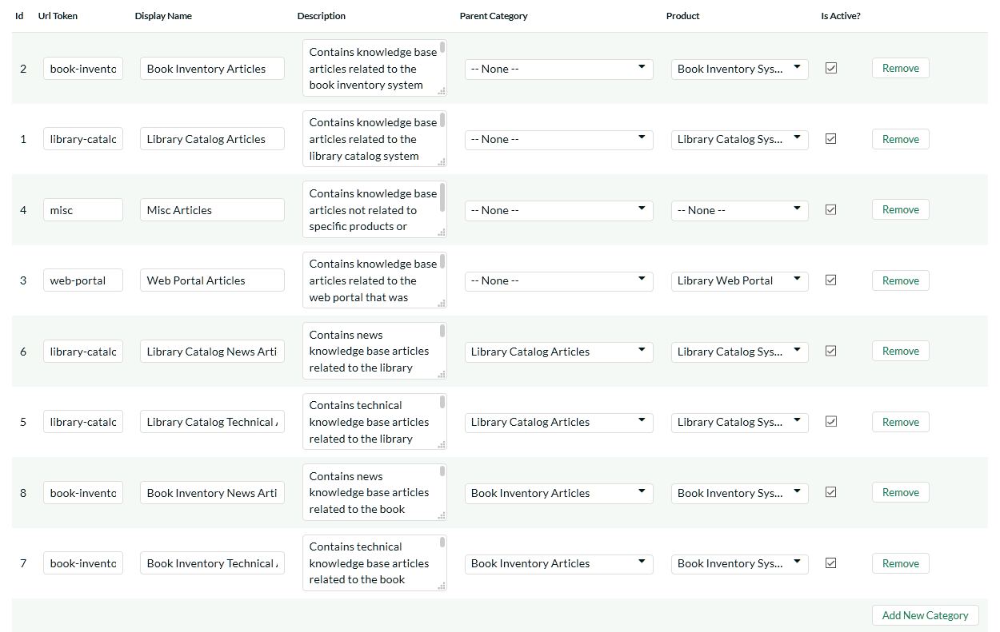

# Knowledge Base Settings

This section contains all of the settings that affect the online
knowledge base part of the application.

## Article Categories

This page lets administrators manage the different article categories
used in the KronoDesk online knowledge base. Each article in the
knowledge base is assigned to one or more article category which is used
to make finding information easier. Typically the article categories are
associated with a particular product or service, although there may be
some general categories that are product agnostic.

When you first open this page, the system will list all the article
categories already in the system. You can use this page to perform the
following operations:

-   **Modify an Existing Category** -- to do this, you simply need to
update the URL-Token, Display Name, Description, Parent Category,
Product and Active flag value for the category and click \[Save\].

-   **URL Token** -- This is the URL segment that will be used to
create the hyperlink to access this forum category (e.g.
<http://myserver/KronoDesk/KnowledgeBase/url-token/List.aspx>).
Url Tokens have to be unique and can only contain alphanumeric
characters and hyphens.

-   **Display Name** -- This is the name of the category that will
be displayed in the category details page.

-   **Description** -- This is the long description of the category
that will be displayed in the category details page.

-   **Parent Category** -- If this is a top-level category, you
should leave it set to "None", otherwise you need to set this to
the name of the existing article category that the category will
be listed under.

-   **Product** -- If the category is related to a specific product,
you should select the product.

-   **Active** -- This should be checked if you want the category to
be visible within the application. Old categories that are no
longer in use should be made inactive.

-   **Create a New Category** -- to this, you simply need to click on
the "Add New Category" hyperlink in the bottom row and then enter
the new category information and click \[Save\].

-   **Delete an Existing Category** -- to do this, simply click on the
"Remove" hyperlink next to the category. You will be asked to
confirm the deletion, after which the category will be deleted from
the system. *Note: If you delete an article category, the system
will delete all the child categories and articles contained within
that category.*

