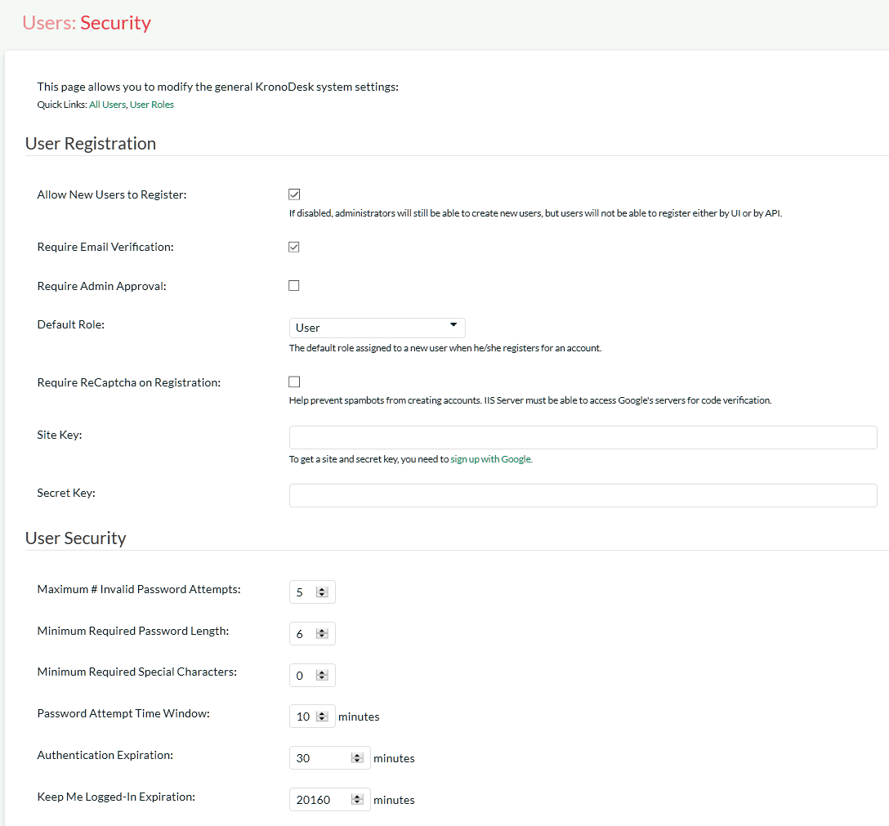
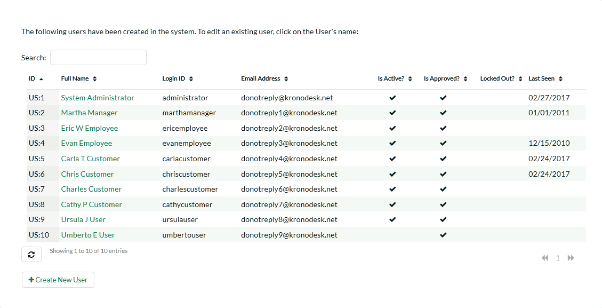
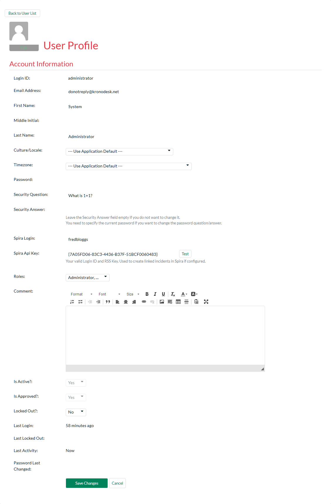
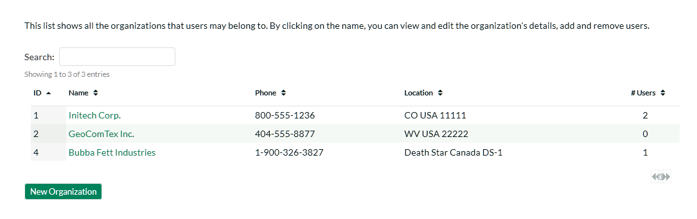
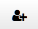
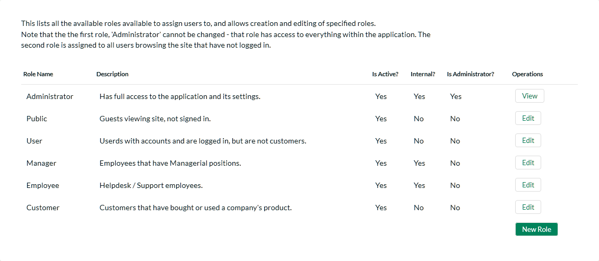
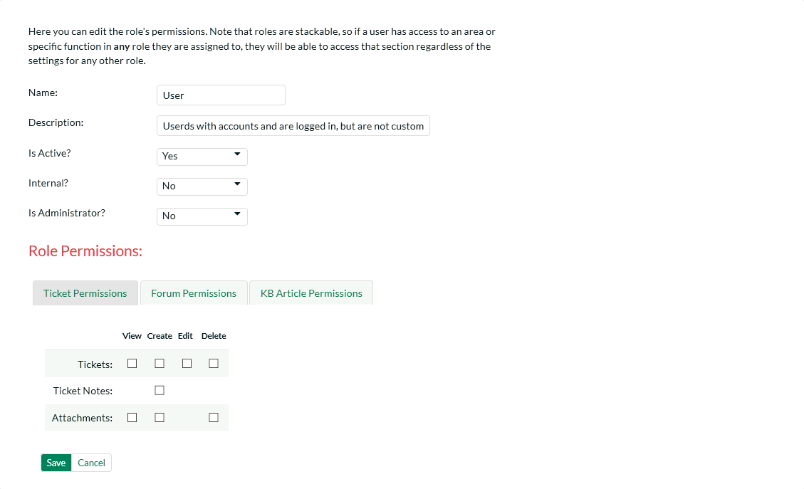
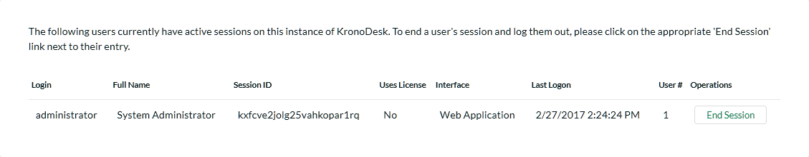

# Users

This section contains all of the settings related to viewing and managing users in the system. Currently it allows an administrator to view the list of users and modify a user's profile as well as see a list of active sessions.

## User Security

This page shows options for configuring user registration and login options. By adjusting the settings here, it is possible to require all users to verify email addresses, turn off new-user registration completely, and require administrator approval of all new users:

Available options are:

- **Allow New Users to Register**: When disabled, new user creation will not be possible, except by an administrator.
- **Require Email Verification**: Sets whether users must verify their email addresses before they will be allowed to log into the system. They will still be able to access the site as a guest, however.
- **Require Admin Approval**: Sets whether all new accounts created will need to be verified by an administrator account.
- **Default Role**: When a new user registers to access your instance of KronoDesk you have an option of assigning them a default role in the system.
- **Require Captcha on Registration**: Sets whether the user must pass a bot/robot check while creating a new account.
- **Site / Secret Key**: Required for the ReCaptcha validation. These are issued by Google (<http://www.google.com/recaptcha/admin>), and must be entered in for the bot-check to activate.
- **Maximum \# Invalid Password Attempts**: Set this to the number of times a user can enter an incorrect password before their account is temporarily locked out. This is important in preventing 'brute force' password hacking attempts.
- **Minimum Required Password Length**: Set this to the minimum length of passwords in the system. Choosing a longer password will make it harder for an unauthorized user to crack a password and gain entry into the system.
- **Minimum Required Special Characters** - Set this to the minimum number of non-alphanumeric characters that will be required for passwords in the system. Choosing more required special characters will make it harder for an unauthorized user to crack a password and gain entry into the system.
- **Password Attempt Time Window**: Set this to the duration (in minutes) after which a user's account will be automatically unlocked (due to repeated incorrect password attempts).
- **Authentication Expiration**: This specifies the amount of time (in minutes) after which a user will be logged out due to inactivity when they login without choosing the 'Remember Me' option.
- **Keep Me Logged-In Expiration** - This specifies the amount of time (in minutes) after which a user will be logged out due to inactivity if they have chosen to login with the 'Keep Me Logged-In' option. This should normally be longer than the previous setting.

## Manage Users

This page will display a list of all the users (both active and inactive) currently in the system:

The users are listed with their name, login, email address, active status, approved status, whether they are currently locked out (for incorrectly entering their password too many times), the date they last logged-in and their user id. You can sort or filter the user list by entering the text in the search box. To view the details of a specific user, simply click on their name which is a hyperlink:

You can update the following fields on this page:

- **login ID**: the user's login ID. This has to be unique.
- **Email Address**: a valid email address that notifications will be sent to. This has to be unique.
- **First Name**: the user's first name
- **Middle Initial**: the user's middle initial (if applicable)
- **Last Name**: the user's last name
- **Comment**: Used for Admin purposes only, the user does not see this on his own account.
- **Culture/Locale**: By default all profiles will be set to use the application's default culture. This means that the language and number formats used in the application will be the ones decided by the person who installed the system. However there are cases where you want to use a different language or number format (for example, a German employee working in the German office of a French company might want to use the German culture instead of French). You can change the culture to any of the options listed in the dropdown list.
- **Time zone** - By default all profiles will be set to use the application's default time zone. This means that the time zone used in the application to accept/display data will be the one decided by the person who installed the system. However there are cases where you want to use a different time zone (for example, a German employee working in the German office of an American company might want to use CET instead of EST). You can change the time zone to any of the options listed in the dropdown list.
- **Password**: if you want to change the user's password, you can enter it in the text box. If you don't want to change the password, you can leave this blank.
- **Security Question/Answer**: if you want to change the user's challenge question/answer, enter a question that only they will know the answer to, together with the matching answer to that question. If you don't want to change the question/answer, you can leave these blank.
- **Roles**: this displays a list of the available roles in the system, with the ones that the user belongs to selected. You can change the roles by selecting them in the dropdown list.
- **Spira Login/API Key**: If you have your KronoDesk install linked up with a Spira install to keep track of development bugs and fixes, entering the user's login and API Key here will allow this user to create and view incidents related to the ticket the user is viewing. Note that these fields are only available for Internal users, and when Spira integration is enabled.
- **Active?**: Used to specify whether this user account is active or not.
- **Approved?**: Used to specify whether this user account is approved or not. Currently all users in the system are created with approved accounts.
- **Locked Out?**: Used to specify whether this user account is temporarily locked due to the user making too many incorrect login attempts.
- **Avatar**: Each user in KronoDesk can have a small graphic icon (an avatar) associated with their account. This icon will be displayed next to forum posts, ticket comments, etc. You can click on the \[Browse\] button to change their avatar or \[Remove\] to switch their user back to the default image.

Once you are satisfied with the changes, you can click \[Update User\]
to commit the changes. If there are any validation errors, they will be displayed, otherwise the system will display a confirmation box.

Log In As User - This button will log you out of you own account, and log you in as the displayed user. OIf that user is currently logged into the system, they will also be logged out. This will enable you to view the system as their user account for determining any issues they may have.

## Create New User

This page allows the administrator to manually create a new user. Email verification will still be needed by the end user if that setting is set. When creating the user, only basic information is set. Then, afterwards, if additional information needs to be saved (such as the user's SpiraTeam API key), it can be done after saving.

## Manage Organizations

This is where you can manage the user's organizations. The system will display a list of configured organizations:

By clicking on the name, you will be taken to the edit page, where you can specify data about this organization:

- **Company Name**: The name of the company. Required.
- **Phone**: Phone number.
- **Address 1, Address 2, City, State, Zip/Postal Code**: Mailing address.
- **Country**: The country. Required.
- **Description**: Displayed when managers/supervisors of the company edit their own profile.
- **Internal Notes**: Displayed for application administrators only.
- **Users**: List of users that are members of this organization.

Users can be added by clicking the add user button (), and selecting the users to be added. There are three roles a user can be inside an organization:

- **Member**: These customers can see other organization tickets and view organization details and members, but can not change them. They can create new tickets.
- **Supervisor**: These customers can edit all organization tickets including changing the opener of the ticket. They can view organization details and members.
- **Manager**: These customers can do everything the Supervisor can, as well as invite new users to the organization.

When users are added to an organization by the application administrator, they are automatically added as a 'Member'. When a Manager adds a user to an organization, they must know the user's email address, and the next time the user logs on they are presented with a prompt to join the organization, which they may accept or deny.

## User Roles

You can create and modify user roles here. By default, the standard roles are:

The following roles exist in the system and can be used when assigned permissions to users:

- **Administrator**: The most powerful role in the system, they can view, create, modify and delete all artifacts in the system (articles, tickets, forums, threads, replies) as well as access the administration section where they can change all application-wide settings.
- **Public**: All users that are viewing the site that are not logged in.
- **Manager**: This role can view, create, modify and delete all artifacts in the system (articles, tickets, forums, threads, replies). This role cannot access the Administration section
- **Employee**: This role can view everything in the non-administration section of the application. This role can view, modify and create tickets, articles, threads and replies. It cannot delete items in the system.
- **Customer**: This role can view all articles and forums, can submit new threads, reply to existing threads, can log help desk tickets and view/modify tickets that they opened only.
- **User**: This role can view all articles and forums, can submit new threads, and reply to existing threads. This role does     not have any access to the help desk ticketing section of the application.

When editing a role, you can give it certain permissions:

The name of the role is used in the Role selection box, when editing a user.

Description is just used for administration purposes, and is not displayed anywhere to end-users.

Internal is a flag -- if set to true, Internal users are considered employees of the company, and have some additional permissions granted to them. If this option is set to 'No', then they are considered an External Customer (End-User).

The tabs then let you specify what the role can do in each section of the application.

**Important Note**: Roles can be stacked -- that is to say, Users can be assigned to more than one role at a time. Roles will be ANDed together. So if ANY role is marked 'Internal', then the user will be considered an employee. Likewise, if ANY role allows a user to create a ticket, then no matter what the other roles say, the user will be able to create a ticket. It is also important to note that is the section is disable entirely, setting a permission here will not have any effect.

## View Active Sessions

Often an administrator of the system will want to know how many users are currently logged into the system, especially on installations licensed by concurrent-user. Clicking on the 'Active User Sessions'
administration option will display a list of all the users who currently have active sessions in the system:

Each user is displayed along with their user ID, whether they're connected through the application or via a third-party add-on, the date they last logged-in, and whether they are being counted as concurrent-user from a licensing perspective. With a concurrent-user license, KronoDesk allows an unlimited number of general user sessions, but only a certain number of customer service agent user sessions.

The administrator is able to forcibly end a user's session using the
'End Session' link to the right of their name. Clicking this link will result in that user being logged out when they try and perform an operation in the system. **Warning: You should make sure that the user is not actively using the system to prevent any unsaved data being lost**.

## Manage Employee Groups

Employee Groups are used to manage tickets and service level agreements (SLAs) for organizations in the system. When groups are defined, tickets can then be assigned to a group of employees, as well as individual employees (as in previous versions of the application).

On the main Administration screen you can edit, delete, or create new groups. Deleting a group will remove all users from the group, and unassign all tickets (closed and open) that were assigned to that group.

Creating or editing a group will give you the following page:

The fields available here are:

- **Group Name**: The display name of the group. This is displayed in the Assignee field for the Ticket.
- **Description**: This is just to describe the usage of this group. Not used anywhere but in Administration.
- **Product**: Assigning a group to a specific product. For future use with SLAs.
- **Members**: The members that are a part of this group.

Changes made on this page take effect immediately - after any users on the ticket pages refresh their display.

