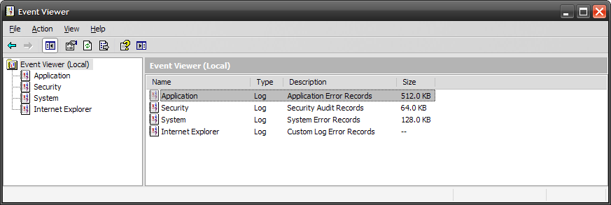
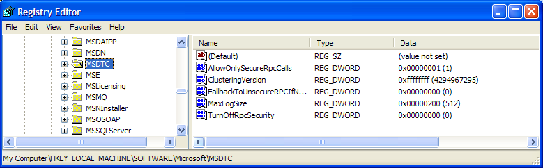
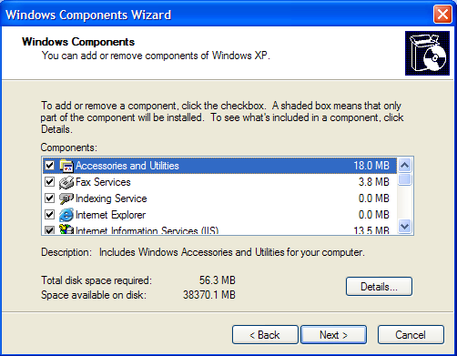
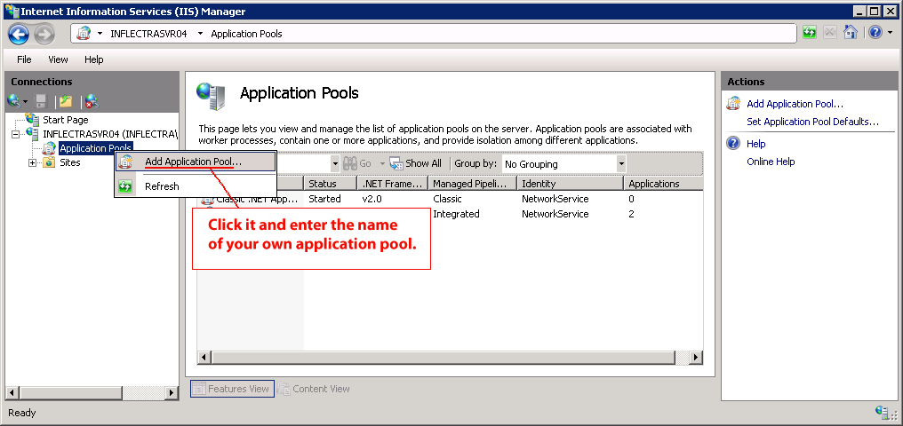
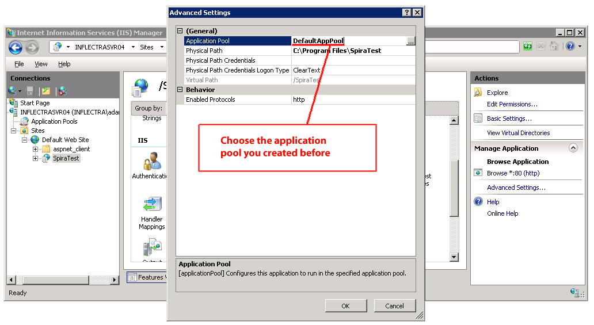

# Appendix A -- Troubleshooting

If you receive the dreaded "IIS 500 Internal Error" or the "Server
Application Not Available" webpage when you try and access KronoDesk®
for the first time, there can be a myriad of causes. However a good
first place to look for the cause is inside the Windows Event Viewer,
which stores all errors raised in the system.

To open the Event Viewer, click Start \> Settings \> Control Panel \>
Administrative Tools \> Event Viewer. This will open up the event
viewer:

Click on the Application and System folders in turn and look for errors
raised by "MSSQLSERVER", "KronoDesk", "DCOM", "ASPNET" or "IIS". Click
on the error message, and copy the text of the message into a text
editor (e.g. Notepad).

Before contacting Inflectra^®^ customer support with the specific error
message, here are a couple of common causes for the above errors
together with the appropriate resolutions:

**The ASP.NET process account has been disabled**\
Go to Start \> Control Panel \> Administrative Tools \> Computer
Management and launch the Windows computer management console. Expand
Local Users and Groups \> Users and then double-click on the \'ASPNET\'
account. Make sure that the ASPNET user is not disabled.\
If you are using Windows 2003 or 2008 Server the ASPNET user is set
per-application pool and typically is set to the built-in NETWORKSERVICE
account, so this won't apply.

**The ASP.NET process account does not have sufficient permissions**\
Right-click on the C:\\WINDOWS\\Microsoft.NET\\Framework\\v4.0.30319
folder (and any other versions of .NET that are listed) and make sure
that the ASPNET, NETWORKSERVICE and LOCALSERVICE accounts are all listed
with Full Control. If that doesn't fit the issue and you are using
Windows 2003 or 2008 Server, open up the IIS manager and right-click on
the Application Pool that KronoDesk® is running under and make sure that
the identity listed has Full Control permissions on the same folders.

**The Windows Event Log is full**\
Open up the Application and System event logs, right-click on the log
name and choose Properties. Make sure that both are set to "overwrite
events as needed". If they are not set to overwrite as needed, change
the setting then manually clear both logs.

If the resolutions above were not able to resolve the issue, please send
an email to <support@inflectra.com> and include the error message from
both the web page and the Windows Event Logs.

## Missing MSDTC Issue

There is one common error that has been found with installations where
Microsoft SQL Server was installed *after* IIS was installed. This
typically affects only Windows XP Professional, but could occur in other
situations. What happens is that the SQL Server installation
inadvertently removes the *Microsoft Distributed Transaction
Coordinator* (MSDTC) service from the system during the installation.

To determine if this is indeed the cause of the observed error, you need
to click on Start \> Settings \> Control Panel \> Administrative Tools
\> Component Services:

Once the window has opened, expand the folders marked "Component
Services", "Computers", "My Computer" and "COM+ Applications" in turn.
If the window opens correctly and displays the information illustrated
above, then your IIS 500 error is being caused by something else.

However if you receive an error message that indicates an inability to
connect with the "Distributed Transaction Coordinator", then you have to
fix the MSDTC service to enable IIS and ASP.NET to operate properly.

To fix the issue, you need to make changes to the Windows System
Registry (hereafter referred to as "the registry"). This is a process
that should **not** be attempted by novice users, since any incorrect
changes can complete wreck the Windows installation, requiring a
complete reinstallation of the operating system.

To open the registry, click Start \> Run, and type "Regedit.exe" into
the dialog box, and the registry will open:

Expand the folders marked "My Computer", "HKEY\_LOCAL\_MACHINE",
"SOFTWARE" and "Microsoft" in turn and navigate to the folder marked
"MSDTC". Click the \<Delete\> button on your keyboard, and click \<OK\>
on the confirmation box. Now close the registry editor.

Now you need to click on Start \>Settings \> Control Panel \> Add or
Remove Programs and click on the tab marked "Add/Remove Windows
Components":

Don't change any of the selected components, but instead simply click
the \<Next\> button. The Windows installer will detect that the MSDTC is
missing (due to the registry change you made) and will now reinstall it
correctly. Once this has finished, reboot the system and you should now
be able to access ASP and ASP.NET applications from within IIS.

## Application Session Pooling Issues (Windows Vista, 7 or 2008)

This issue can affect Windows Vista, 7 or Server 2008 using IIS 7.0.
Since the 6.0 release of IIS, there is the ability to separate the
web-server into different "Application Pools". Sometimes, web hosting
companies will host multiple websites in the same application pool
(which we do not recommend). When resources are maxed out for an
application pool IIS 7 starts to recycle these sites causing application
variables to be lost for those recycled sites. *By default, KronoDesk
installs on these operating systems in its own application pool*.

***If you are experiencing application/session loss symptoms*** then we
recommend asking your web hosting company to verify that your instance
of KronoDesk is running in its own application pool with all recycling
options disabled and the recycle worker process set to recycle only once
during the day at a set time.

To make these changes yourself, you need to follow these steps:

Add new application pool for "KronoDesk" (if one does not already exist)
and make sure it is set to use the .NET Framework v4.0 and the
"Integrated Pipeline":

Next, choose your own application pool in the KronoDesk web site
properties:

