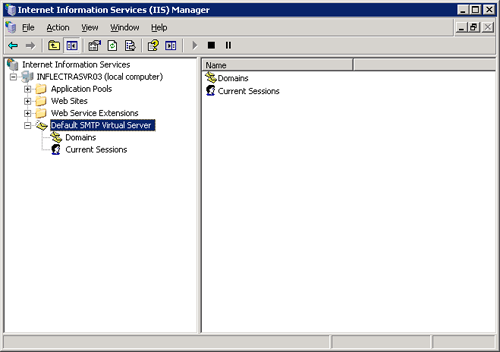

# Appendix C -- Sending Email through IIS

This section outlines the steps that you need to take to configure your
IIS web server to send email notifications from KronoDesk®. Since email
configurations can vary greatly between environments, please check with
your local IT personnel for the correct settings that should be used.
This section assumes that you have an SMTP mail-server available on your
network that is capable of relaying the email from the IIS server.

First open up the Internet Information Services (IIS) Manager on your
server and expand the Default SMTP Virtual Server node:

Right-click on the "Default SMTP Virtual Server" node and click on
"Properties". Then select the "Delivery" tab on the dialog box that
pops-up:

Now, click on the <Advanced\> button to bring-up the advanced delivery
configuration screen:

In this dialog box, you should enter the following information:

- **Masquerade domain:** 
This is the domain name that you want emails from KronoDesk® to look
like their being sent from. This is typically the domain name of your
organization (e.g. mycompany.com)

- **Fully-qualified domain name:** 
This is the fully qualified domain name of the IIS server that
KronoDesk® is installed on (e.g. iisserver.mycompany.com).

- **Smart host:** 
This is the fully qualified domain name of the SMTP mail-server that
will actually be used in delivering the emails. (e.g.
mail.mycompany.com). You will need to get the name of this from your IT
personnel.

Once you have updated the settings, click the various <OK\> buttons and
you should now see emails being delivered from KronoDesk®. Note: the
email address that is used as the 'from address' for all emails
generated by KronoDesk® is the email address stored in the Administrator
user's profile. You should edit that user's account and make sure their
email address is a valid email address in your environment.

