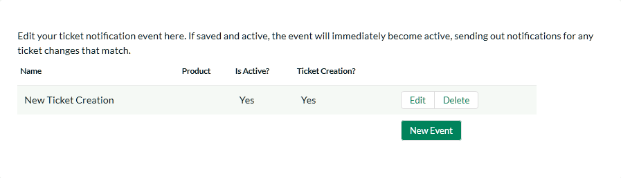
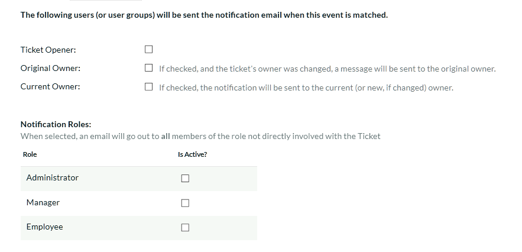
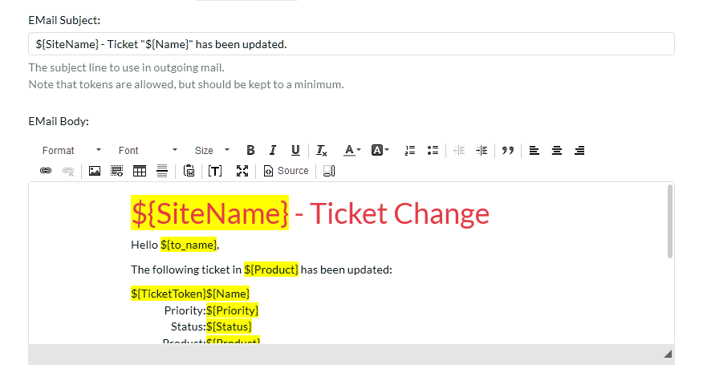

# Event Notifications

This section allows you to customize the email notifications that are
sent out by KronoDesk when specific help desk events occur in the
system. When you first click on the section link, the system will
display a list of any notification events that already exist:

To create a new event, click on the 'Create New Event' hyperlink. That
will display the page that lets you add or edit help desk notification
events:

For each event you need to specify the name of the event, this is not
used in the email and is just used to help you identify what the purpose
and scope of the notification is (e.g. "Send emails to customers when a
new ticket is logged"). In addition, you should specify if the event is
active or not and what product that the event is active for. That way
you can have different events occur for different products.

The **Firing Events** section of the notification lets you specify which
events will trigger the notification being sent. There are three types
of event that can occur:

**New Ticket** -- When a new help desk ticket is created (by a customer)
this event is triggered. If you want the notification to be sent when a
new ticket is created, you should check this option.

**Note Added** - When a note is added by a user to an existing help desk
ticket, this event is triggered. If you want the notification to be sent
when a note is added, you should check this option.

**Field Changed** -- When one of the checked fields is changed by a
user, this event is triggered. Check any of the fields that you want to
trigger the notification in question.

The **Notified Users** section of the notification lets you specify
which users will receive the email notifications when the event gets
triggered. There are four types of user that can be specified:

**Ticket Opener** -- This option will result in the notification being
sent to the person that originally opened the ticket.

**Original Owner** -- This option will result in the notification being
sent to the person that the ticket was originally assigned to.

**Current Owner** -- This option will result in the notification being
sent to the person that the ticket is now assigned to.

**Notification Roles** -- These options allows you to specify which
other roles in the system will get notified about changes to the ticket.
Only Internal roles can be selected.

The **Email Template** section lets to specify the template used for the
email notification in question. The template consists of the email
subject line and body.

Similar to the settings in System -\> Email, tokens can insert relevant
data to the ticket into the email. Using the token button (**\[T\]**) in
the toolbar.

Tokens will be replaced when the email is sent out with information
relevant to the ticket or system configuration at that time.

