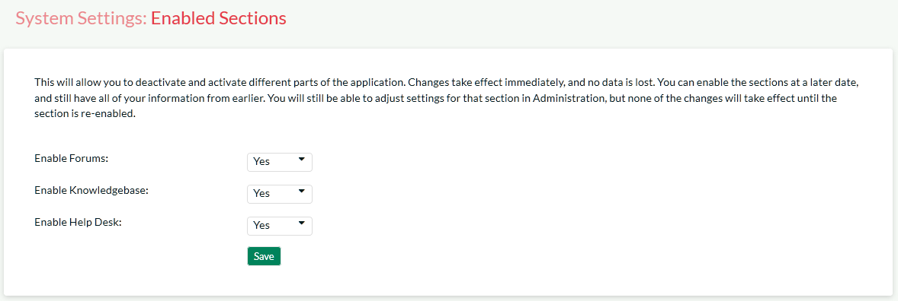
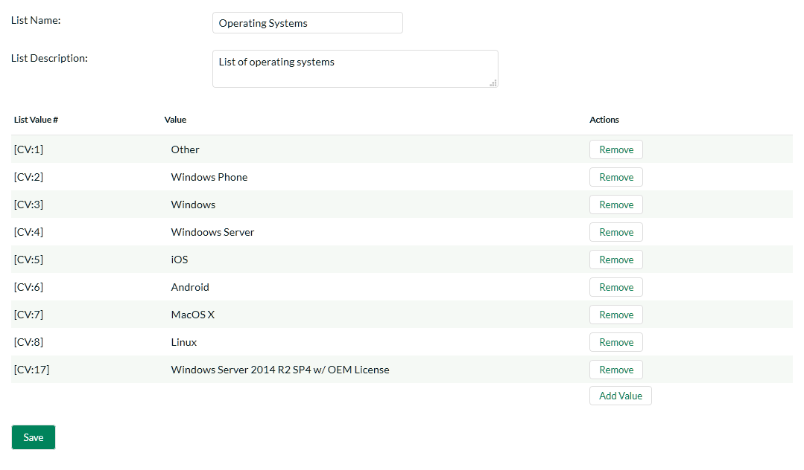

# System Settings

This section contains all of the application-wide settings that affect
the entire system, rather than a specific module. The only exception is
that the settings related to authentication and user management are in
their own separate group "User Settings".

## General Settings

The General Settings page is used to set the general application-wide
settings that affect the overall application and are used to ensure that
the application matches your environment. In the current version, you
can specify the default language, specify the base URL, configure the
folder used to store document attachments and also specify whether
certain parts of the application should require a secure connection.

This page lets you specify the following values:

-   **Default Culture** - KronoDesk can display information in a variety
of different languages (assuming that the appropriate language packs
have been installed) and number formats. By default, KronoDesk will
use the regional settings (language and number formats) of the
operating system it has been installed on. However, you can override
this default by choosing the appropriate culture from the list of
options displayed in the drop-down list. *Note: The list of culture
options does not reflect the available language packs, so in some
cases, the setting will only change the number formats.*

-   **Default Time Zone** - KronoDesk stores all dates and times
internally in Universal Coordinated Time (UTC) and can therefore
display dates/times adjusted for different time zones. By default,
KronoDesk will display dates in the time zone specified in the
operating system it has been installed on. However, you can override
this default by choosing the appropriate display time zone from the
list of options displayed in the drop-down list.

-   **Attachments Folder** - By default when KronoDesk is installed, the
document attachments uploaded in the system get stored inside the
    C:\Program Files\KronoDesk\Attachments folder
located inside the main KronoDesk installation root. However you may
want to have the documents stored on a remotely mounted drive or on
a different hard disk partition. In which case you can simply change
the folder pointed to in the text-box illustrated above and then
click \[Save\] to commit the change. When changing the directory, be
sure to move any existing attachment files to the new location, and
verify that the IIS User has read and write access to the directory.

<!-- -->

-   **Application Base URL** - This is the URL that your users use to
access the system. Do not put the /Login.aspx or any other page
here, as this URL is used to generate links to different pages in
the application. This setting is primarily used in email
notifications and RSS feeds to specify the URL of the application.

<!-- -->

-   **Require SSL** -- When this is selected, the application will
require a secure connection when accessing the Account Profile
pages. This is useful if you want to run the site using an
unencrypted connection (to maximize performance) but want to require
a secure connection for the login pages where a user will have to
enter a password. Using this option requires that you have a Secure
Sockets Layer (SSL) certificate installed on your web server.

-   **Use SQL Free Text** -- If possible, when running searches and
queries, have the application use SQL's Free Text indexing to speed
up result pages to users. Note that enabling Free Text Indexing will
require higher minimum system requirements for the SQL Server.

-   **Allowed Domains** -- This is used when accessing the KronoDesk
REST API from another web page using a Cross Origin Request Sharing
(CORS) based REST request. In KronoDesk you need to specify the
allowed domains (or \* for all) which are allowed to make sure a
request.

-   **Authoritative Domain/Protocol** -- In case where multiple domains
point to the same installation (i.e. www.kronodest.net and
kronodest.net), any access to the application will redirect to the
domain and protocol entered here.

## Enabled Sections

This section allows you to activate and deactivate different parts of
the application (for example you might not want to initially make the
support forums available to customers). Changes take effect immediately,
and no data is lost. You can enable the sections at a later date, and
still have all of your information from earlier. You are still able to
adjust settings for a disabled section in Administration, but none of
the changes will be visible until the section is re-enabled.

## Appearance

The Appearance page is used to customize the information displayed in
KronoDesk and edit the colors and theme of the application.

### Theme Tab

The first tab lets you select a pre-generated theme to use or create a
new theme or edit an existing theme.

On this tab, you can select and 'Apply' the theme you want to use for
the application. Or, if you select 'Edit Selected Theme' or 'Create New
Theme', you will be taken to the theme edit window:

By selecting the colors in the selection boxes, the live preview window
will update to show how the actual application will work, using a sample
page. Once you have your design configured, click the 'Save' button to
return to the theme selection. Then, click the 'Apply Theme' button to
apply the designed theme to the whole application. **Do not** set all
colors to the same value! Your users will not be able to navigate the
site.

### Branding Tab

This tab is where you can specify static information relating to your
company, external links and other fixed-page items.

This page lets you specify the following values:

Images:

-   **Company Logo** -- This is the image that is displayed in the top
left corner of the navigation bar, on wider devices. (Desktops,
tablets in landscape mode, etc.)

-   **Mobile Logo** -- This is the image that is used in the top left
corner on smaller devices.

Company Information:

-   **Company Name** -- This field is used to change the name of the
company that is displayed in the application footer

-   **Copyright Year** -- This field is used to change the copyright
year to match the starting year of your company's website copyright.

-   **Contact Phone Number** -- This field is used to specify the phone
number that should be displayed on the application footer

-   **Email Address** -- this field is used to specify the email address
displayed on various pages within the application. We recommend that
you set this to match your primary support email address (e.g.
<support@mycompany.com> or <info@mycompany.com>).

-   **RSS Feed** -- The application home page will display a list of
recent news headlines from your company's newsfeed. To enable this
functionality, simply enter the URL for your company's RSS newsfeed
into this text box and it will automatically enable the home page
widget and tell it to display news items from your newsfeed.

-   **Title Prefix** -- All of the web pages in KronoDesk prefix the
title of the page with the application name (e.g. "KronoDesk \| Help
Desk" or "KronoDesk \| Support Forums"). This setting allows you to
choose the text displayed in the prefix. We recommend we set it to
your company's name. That way, web pages will be displayed using
this name (e.g. "MyCompany \| Help Desk").

Hyperlinks:

-   **Header Icon Link** -- This is the URL to take the user to when
they click the company logo.

-   **Useful Link \#1 - \#3** -- These are the names (text) and the URLs
to display to the user. These can be used in Email templates for
notifications going out to users, and are displayed on the
customer's home page.

-   **Footer Link \#1 - \#3** -- These are the names (text) and the URLs
to display to the user. These are displayed in the footer of the
application.

[Page Texts:\
]{.underline}This is a list of links to pages that have inline editors
to edit and adjust how the pages look to users viewing the pages.

Page Javascript:\
This allows the administrator to add some script to execute on every
page. All pages will run the Javascript entered here, except for
Administration pages. This would be used to enter in Analytics trackers
or other SEO or ROI tracking code.

## Email Configuration

This section allows you to change the settings regarding how KronoDesk
sends out email notifications. There are several tabs that you contain
different settings:

### Email Options

This tab allows you to change some of the basic high-level email
settings:

The options are:

-   **Allow Outgoing Emails:** Turning this off will disable ALL
outgoing emails. Note that with this off, the email importer cannot
be used, as users created via the importer will not be able to
verify their account.

-   **Send User Welcome Email:** When this is enabled, a new registered
user will receive a welcome email.

-   **Notify Admin of New User:** When enabled, the administrator
account will be sent an email notifying of a new user registration.

-   **From Email Address:** On outgoing emails, this name and address is
the email account the email will come from.

-   **Reply-To Email Address:** On outgoing emails, this name and
address will be in the 'Reply-To' header of the email.

-   **Force Email Control?:** This setting lets the users define their
own email options. If enabled, then users will not be able to
disable receiving emails from the application. If disabled, they
will be able to turn off email notifications.

-   **Send Email Separator:** Recommended if using the Email Importer
for importing support tickets from an email account. Enabling this
will add a line that will help the Importer keep reply text as
minimal as possible.

### SMTP Server

This page allows for setting up KronoDesk to communicate with your SMTP
Server. The fields available and their usage are:

The options are:

-   **Use IIS Mail Server Settings**: If set to 'No', you must define
your SMTP server information below. If set to 'Yes', the application
will use the defined IIS virtual server settings.

-   **SMTP Server Hostname / Port**: The DNS or IP address of the SMTP
server, and the port that it accepts incoming mail on.

-   **Use SSL Connection**: Whether or not the SMTP server requires an
SSL connection.

-   **SMTP Server UserID / Password**: The username or password to log
onto the SMTP server with. If no username or password is required,
enter in 'anonymous' in both fields.

### Mail Templates

This tab allows you to customize the email templates that are sent out:

To modify a template, you need to select which template you wish to
edit. Once you select the template, the page will reload and display the
selected template. The subject line is used in all emails sent with this
template -- note that some templates do not have a subject defined, and
in this case the field will be hidden.

With this editor, you can link to external images, but cannot send any
images as attachments.

You can modify the template to make it match your company's styles,
adding colors and fonts as needed.

Outgoing data uses a Token system. You can select a token to insert
using the Token button in the toolbar of the rich text editor
(**\[T\]**). It will open a dialog letting you select the token to
insert.

Available templates to edit are:

-   **User: New User Registration**: If the 'Send new user welcome
email' setting is set to true, this email template is sent out when
a user registers.

-   **User: Forgot Password**: When the user forgets their password.

-   **Forums: Subscription**: Sent when there is an update to a forum
that the user is subscribed to.

-   **KB: Subscription**: Send when there is an update to a Knowledge
Base Article that the user is subscribed to.

-   **User: Inactive Account Created**: Sent out when a user had an
account created for them via the Email Importer application.
Contains information on how the user can verify their account to be
able to log into the website.

-   **Ticket: Notification**: Sent out when a notification event is
fired off due to a ticket update. This is the master template -- the
template can be edited per notification event when the event is
created.

## Custom Lists

Custom Lists at this time are used in [Custom](#custom-fields) Field
definitions. The main custom property list screen lists all available
lists available for assignment to a custom field.

The table shows all defined custom lists and their information. The
Custom List ID, the name of the list, how many selectable options it
has, and then actions you can perform on the list -- Edit the Values,
Remove (delete) the list, or add a new list. Lists must have a unique
name.

When creating or editing a list, the following screen is displayed:

The list name and description are for identification purposes only, and
are not visible to other users in the application. Each list item must
have a unique name, if you try to add a duplicate or empty value, an
error will be thrown. Click the 'Save' button to save your values, and
use the link at top to return to the main Custom List page.

## Product Definitions

Products are used throughout the system in various ways. For tickets and
in the knowledge base, they are used to classify and for organization,
and to help the user find information they need to help them. The screen
for editing and creating products is:

The fields are used as follows:

-   **Token**: Not used at this time, however, each product must have a
unique token ID.

-   **Display Name**: This is what the product will display to users
when selecting or researching a product.

-   **Description**: This is a short description for internal use to
describe the product.

-   **Workflow**: This is the selected workflow for Tickets assigned to
this product. See [Workflows](#workflows), below.

## License Details

The license details page displays the information about the installed
license for the particular instance of KronoDesk® being used. The
information displayed includes: the product name, the license version
(e.g. v2.0.0.0), type of license in effect (x-user fixed, x-user
concurrent, demonstration, enterprise, etc.), the organization that the
license belongs to, the actual license key code and finally the number
of agent-users concurrently logged-in. This last piece of information is
useful as it helps administrators track down how many agent licenses are
being used.

A sample page is illustrated below:

To change the license key used by the system (for example, if to upgrade
from Trial edition to Standard edition), you do **not**
need to reinstall KronoDesk. All you need to do is simply change the
information in the **organization** and **license key** text-boxes to
match the license key and organization name found in the customer area
of our website (<http://www.inflectra.com/CustomerArea>) and click the
\<Update\> button.

If there is an issue with the license key (e.g. a trial version that is
passed its expiration date, or where the license key doesn't match the
organization name) an error will be displayed describing the specific
issue with the information you entered. If you are unable to get the
system to work with the license key information, please contact
Inflectra^®^ customer support at: <support@inflectra.com>.

## Event Log 

The "System Event Log" administration page lets you view all of the
errors, warning and other diagnostic messages that have been logged in
the system:

Each event entry is displayed along with the date-time it occurred, the
type of event (error, warning, information, success audit, failure
audit), category (application, source code provider,
data-synchronization) and the short name. To view the full details of
the error or warning, click on the "View Item" button:

The popup dialog box will display the full error message log and stack
trace in a moveable dialog box. This information should be provided to
Inflectra customer support if you log a help desk ticket.

## Remove Sample Data

This administration link is only available while the system still has
sample data in it. This administration option will remove all data that
was added in at installation, with the following guidelines:

-   **Users**: All users between ID 2 and ID 11 will be removed. The
main Administrator account, and any users created after installation
will remain.

-   **User Organizations**: The two sample organizations will be
removed.

-   **Tickets**: All tickets created at installation will remain, except
for the first 28 tickets which were installed

-   **Ticket Statuses, Priorities, Resolutions, and Types**: All these
will be removed, unless any are used in tickets that were created
after installation.

-   **Custom Property**: All custom property definitions for Tickets
will be removed.

-   **Attachments**: All attachments created at installation will be
removed.

-   **Articles**: Articles 1 to 28 will be removed.

-   **Products**: All predefined products will be removed, unless they
are in use by any tickets not removed.

-   **Categories**: Categories 1 through 4 will be removed, including
all forums and threads contained therein, even if they were added
after installation.

This can only be run once, and cannot be undone without reinstalling the
entire application, so please **use with caution!**

Some sample data will remain, depending on what data was added before
the remove action was run. Depending on the data, there may be some
foreign links in the database that will prevent some sample data from
being removed.

## Orphaned Documents:

In some occasions, there can be attachments stored on the system that
are not deleted when their associated item is deleted. This can cause
unused files to fill up the attachments storange directory. This page
will show the administrator any attachments in the database that have no
associated link to a ticket or KB article, or documents on the file
server with no record in the database:

By clicking the 'Purge' button, the system will be cleaned of all unused
files and unlinked attachments.

