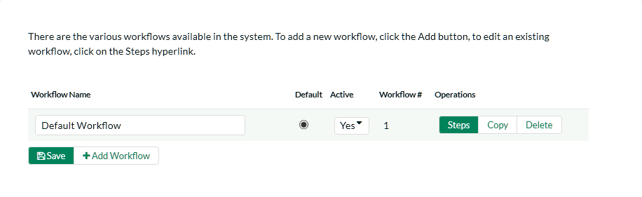
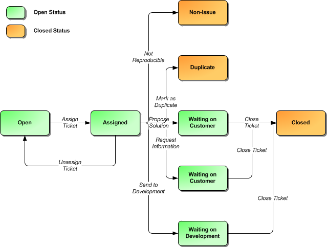
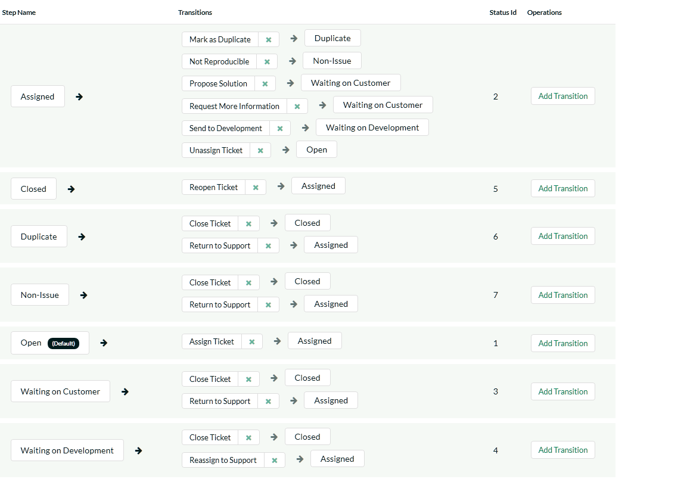
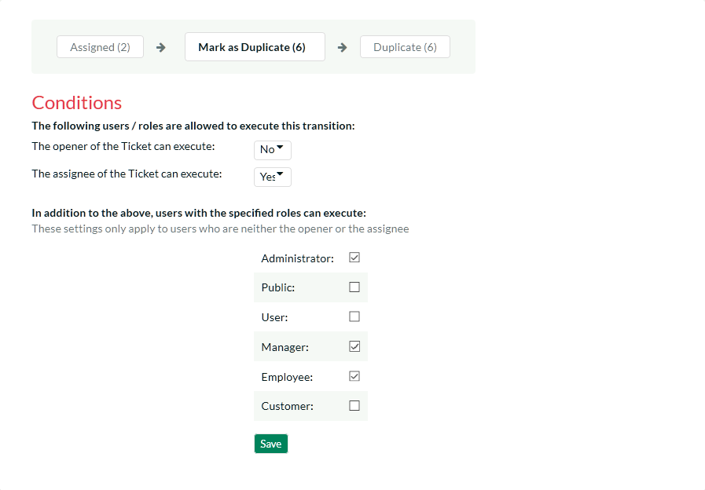
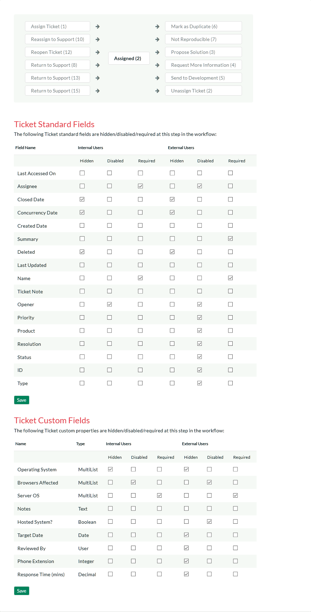

# Workflows

This section displays a list of the defined ticket workflows in the
system. A workflow is a predefined sequence of ticket statuses linked
together by "workflow transitions" to enable a newly created ticket to
be reviewed, prioritized, assigned, resolved and closed, as well as to
handle exception cases such as the case of a duplicate or
non-reproducible ticket. The initial workflow list screen when you first
use the system is illustrated below:

To modify the name, default status, and/or active flags, simply change
the values in the appropriate text-box, radio-button or drop-down list
and click the \[Save\] button. To add a new workflow, simply click the
\[Add Workflow\] button and a new workflow will be created with the
standard KronoDesk steps and transitions.

You can have as many workflows as you like in a project, but only one
can be marked as the default. Each KronoDesk product is assigned to a
workflow; this allows you to have support tickets for different products
follow different paths from creation to closure. However when a new
product is created, it will be initially associated with the default
workflow. The steps and transitions that make up the default workflow
are illustrated in the diagram below:

Note: You can only assign an active workflow to a KronoDesk product, and
similarly you cannot make a workflow inactive that is currently linked
to at least one product. This is important as all products need to be
linked to an active workflow at all times.

## Edit Workflow Details

Clicking on the \<Steps\> button of an inactive workflow brings up the
following screen that lists all the workflow steps and workflow
transitions that comprise the workflow:

This page lists in the left-most column all the various incident
statuses defined in the system. The next column lists all the possible
transitions that can occur *from that status*. In addition, with each
transition is listed the name of the resulting *destination status* that
the transition leads to. E.g. from the assigned status, depending on
your role (see later) you can move the ticket to either Open, Waiting On
Customer, Waiting on Development, Duplicate and Non-Issue depending on
which transition the user takes.

Clicking on the name of a step or transition takes you to the
appropriate details page (see below) where you can set the properties of
the step or transition respectively. To delete an existing transition,
simply click the \<Delete\> button after the transition name, and to add
a new transition, click the \<Add Transition\> button in the Operations
column.

## Edit Workflow Transition

When you click on the transition name link from the previous screen, you
are taken to the workflow transition details screen:

The top part of the screen is the "workflow browser" which illustrates
how the transition relates to the workflow as a whole. It displays the
current transition in the middle, with the originating and destination
steps listed to either side. Clicking on either ticket status name will
take you to the appropriate workflow step details page. This allows you
to click through the whole workflow from start to finish without having
to return to the workflow details page.

Each transition has a series of conditions which need to be satisfied
for a user to actually execute the transition (i.e. move the ticket from
the originating status to the destination status). The conditions allow
you to set three types of user role:

The opener of the ticket can be allowed to execute the transition when
the transition occurs. For example, when a ticket is marked as Waiting
on Customer, the opener should be the only one who's allowed to move it
to Closed.

The assignee of the ticket can be allowed to execute the transition when
the transition occurs. For example, when a ticket is marked as Assigned,
the assigned agent should be the only one who's allowed to move it to
Waiting on Customer.

A user with a specified role can be allowed to execute the transition,
when the transition occurs regardless of whether they are the opener or
assignee. For example a user with role "Manager" might want the power to
close all tickets regardless of assignee status.

Whether a Digital Signature is required for this transition or not. If
set to Yes, then when the transition is performed, the user must
re-enter their username, password, and a note (if applicable) on the
transition. This signature is recorded in the History for future
reporting.

You can set any of these conditions by changing the drop-down list
and/or check-boxes and clicking the appropriate \<Save\> button.

## Edit Workflow Step

When you click on the ticket status name link from either of the
previous screens, you are taken to the workflow step details screen:

The top part of the screen is the "workflow browser" which illustrates
how the step relates to the workflow as a whole. It displays the current
ticket status in the middle, with the possible originating and
destination transitions listed to either side. Clicking on either
workflow transition name will take you to the appropriate workflow
transition details page. This allows you to click through the whole
workflow from start to finish without having to return to the workflow
details page.

This page allows you to define the behavior of the various ticket fields
(i.e. those that are a standard part of KronoDesk such as Priority) and
ticket custom properties for this particular step in the workflow. You
can set each of the fields/custom properties as being hidden, disabled,
and/or required for each step in the workflow, and for Internal
(support) users, and External (end-user) users. Note that you cannot set
a field/property as being required and disabled since this would prevent
a user from ever updating the ticket. For example, when a ticket is in
the Open status, you might make the assignee field inactive (since the
opener shouldn't need to know who will ultimately work on it), when it
gets to the Assigned status, you might make the field enabled and
required. This allows you to tailor the information gathered to the
appropriate place in the workflow.

To actually make these changes, all you need to do is select the
appropriate checkboxes in the list of fields and custom properties and
click the corresponding \<Save\> button.

