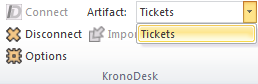
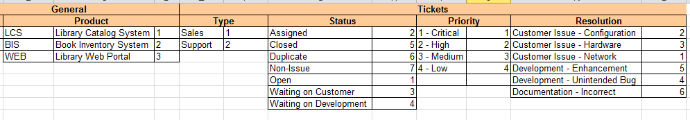
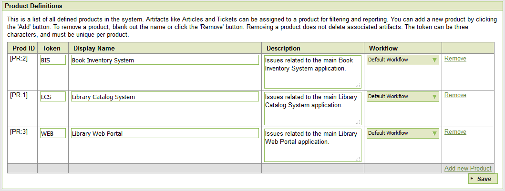
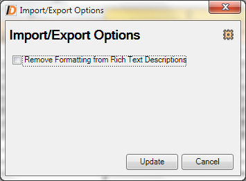

#  Importing from Microsoft Excel

The web-based interface of KronoDesk® is ideal for managing your
company's support desk. However when first standing up the system, you
may have legacy help desk tickets already in another system or in an
Microsoft Office document (e.g. Excel), it is useful to be able to load
in a batch of such legacy help desk tickets, rather than having to
manually enter them one at a time.

To simplify this task, KronoDesk® comes with a Microsoft Excel Add-In
that can export help desk tickets from a populated Excel sheet into
KronoDesk®.

## Installing the Microsoft Excel Add-In

The first thing you need to do is to go to the KronoDesk "Add-Ons and
Downloads" page of the Inflectra Website (it can be found in the
KronoDesk section), and download the **MS-Office Add-Ins** installation
package:

> **MS-Office 2010 Add-Ins** -- these are compatible with Microsoft Office
2010 and 2013. They can connect to KronoDesk v1.1 or later. They also
require Microsoft .NET 4.0.

This installation package will install the add-ins for Microsoft Excel
onto your local PC You can connect to either a cloud-hosted or
on-premise version of KronoDesk. If you don't have the correct version
of Microsoft .NET installed or some of the necessary prerequisites, you
will be given the opportunity to install them when you first run the
installation package.

Once you have the Excel Add-In installed, the second thing you'll need
to download is the **KronoDeskImportTemplate** Excel Sheet. This
spreadsheet contains the necessary pre-formatted columns that are needed
for the Add-In to easily recognize the data and know how to handle it.

Once you have downloaded the template, please double-click on it to open
it up in MS-Excel. You will notice that there is an additional ribbon
entry under the "Add-Ins" tab in Excel which is used for
importing/exporting data to/from KronoDesk:

This ribbon allow you to connect to KronoDesk, and perform the
import/export. The process for using this toolbar is described below:

## Connecting to KronoDesk®

The first thing you need to do is to click on the \[Connect\] button to
specify the information used to connect to your instance of KronoDesk:

Please enter the following information into the dialog box:

-   **KronoDesk URL:** Please enter the web address that you use to
access KronoDesk® in your browser. This is usually of the form
<http://hostname/KronoDesk> or <https://mycompany.kronodesk.net>.
Make sure that you remove any suffixes from the address (e.g.
Default.aspx).

-   **User Name:** Please enter the username that you use for logging in
to KronoDesk

-   **Password:** Please enter the password that you use for logging in
to KronoDesk

-   **Remember Password:** If you are using this Add-In on a private
computer, you can check this option to have the system remember your
credentials locally. Please do not use this option on a public
computer and it will compromise the security of your KronoDesk
installation.

Once you have entered the necessary information, please click
\[Connect\] to authenticate with the server. If the login information is
invalid, you will see an error message appear, otherwise you will be
connected and the list of projects and artifacts will be populated. If
you want to end your session, you should just click the \[Disconnect\]
button and the Add-In will close your connection.

## Choosing the Artifact Type

Once you have successfully connected to KronoDesk, you should now choose
the appropriate Artifact in the system that you will be importing /
exporting (*currently only Tickets are supported*):

The artifact choice will match the name of the Excel sheet in the
template, so if you are going to be exporting Tickets, you should choose
"Tickets" from the dropdown list and then click on the "Tickets" tab
inside the Excel import template.

Once you have selected the artifact, there are three buttons that you
can now use:

-   **Export:** Clicking this button will take the data in the
spreadsheet and use it to add/update items in KronoDesk.

-   **Import:** Clicking this button will retrieve the data from the
KronoDesk server and use that to populate the spreadsheet. \[This is
currently not available in the Add-In\]

-   **Clear:** This button allows you to quickly clear the data in the
import template while leaving all the necessary headings and other
information that the Add-In needs to be able to import/export data.

-   **Options:** This button allows you to change some of the
import/export options.

## Exporting Data

The Excel Add-In is capable of exporting help desk ticket data from the
Excel template to KronoDesk.

### Configuring the Lookups

The Excel template contains a special 'Lookups' sheet in the Excel
workbook. Before actually performing the export, you should review this
sheet to make sure the list of products, statuses, priorities and
resolutions match your instance of KronoDesk:

Normally you would need to change at least the list of Products (since
it will have the three sample products by default) and depending on how
you have customized your instance, you will also need to adjust the
statuses, priorities and resolutions (currently Type is not used and can
be ignored).

To get the appropriate list of products, statuses, priorities and
resolutions, go to the Administration section of KronoDesk and display
the appropriate screens. For example, for products:

Make sure that the products, statuses, priorities and resolutions in the
Excel workbook match the ID and the value displayed in KronoDesk. Once
that has been done, you are now ready to export your data.

### Exporting Tickets

To export tickets, first you need to click on the "Tickets" sheet in the
Excel workbook:

Next you should click on the \[Clear\] icon to first remove the sample
information from the spreadsheet. Once you have the sheet ready for
export, you need to either enter the tickets into this specially
formatted spreadsheet or cut and paste them in from another existing
Excel sheet that you've been using to manage tickets previously (or from
the output of another tool). Then click \[Export\] and the new items
will be added to your instance of KronoDesk.

The various columns that can be imported/exported, and the rules for
entering data are listed below:

|   |   |
| ----- | ----- |
| Tkt \#                  | Stores the ID of the ticket. Should be left blank for new items being added to KronoDesk |
| **Ticket Subject**      | The subject / name of the help desk ticket. |
| **Ticket Description**  | The long description of the ticket. If you want it formatted, you need to add HTML tags such as <b\> for bold |
| **Product**           |   The name of the KronoDesk product that you want to associate the ticket with. It needs to be one of the values from the dropdown list. |
| **Status**            |   The status of the ticket. It needs to be one of the values from the dropdown list. |
| Priority              |   The priority of the ticket. It needs to be one of the values from the dropdown list. |
| Resolution            |   The resolution of the ticket. It needs to be one of the values from the dropdown list. |
| Opener                |   The user that opened the ticket. Needs to be the ID of the user (e.g. user US00005 would be entered as just 5). If left blank, it will default to the user logged in through the Add-In. |
| Assignee              |   The internal user that the ticket should be assigned to Needs to be the ID of the user (e.g. user US00005 would be entered as just 5) |
| Creation Date         |   The date that the ticket was logged. If this field is not populated, the current date is used instead |
| Closed Date           |   The date that the ticket was closed. Do not enter a value in this field if the ticket is not in a closed status. |
| Comment               |   The description of a comment/note that should be appended to the ticket. If you want it formatted, you need to add HTML tags such as <b\> for bold. *Note that this field always appends, so if you want to add two comments, just enter the first value and click \[Export\], then replace it with the second value and click \[Export\]* |

Note: the columns that are required are listed in **bold** type.

## Changing the Import/Export Options

You can change how the import/export works by clicking on the Options
icon. This brings up the Options dialog box:

When you import artifacts from KronoDesk into MS-Excel, if they have a
formatted description, by default all the HTML tags that are used to
describe the formatting will be loaded into the Excel cell. This is
useful if you plan on making changes and then updating KronoDesk (since
it will preserve the formatting).

However if you want to be able to more easily read the descriptions in
Excel and do not plan on updating KronoDesk, you can select the option
to Remove the Formatting, which will convert the descriptions to
plain-text before loading them into Excel.

