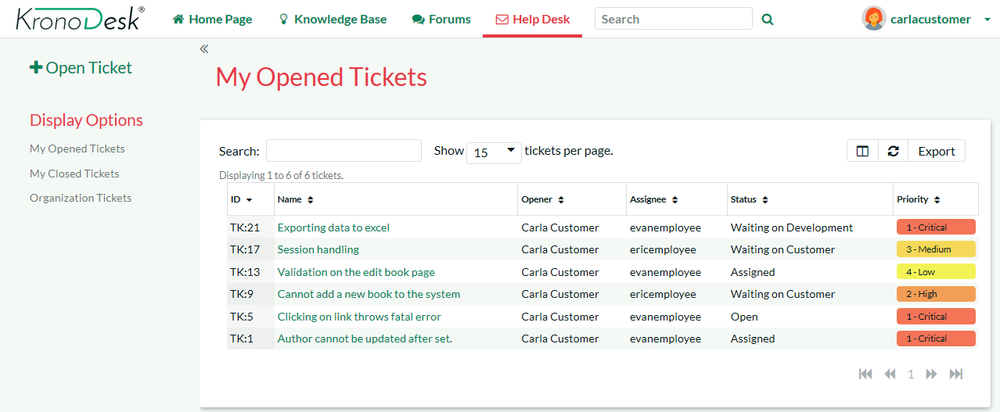
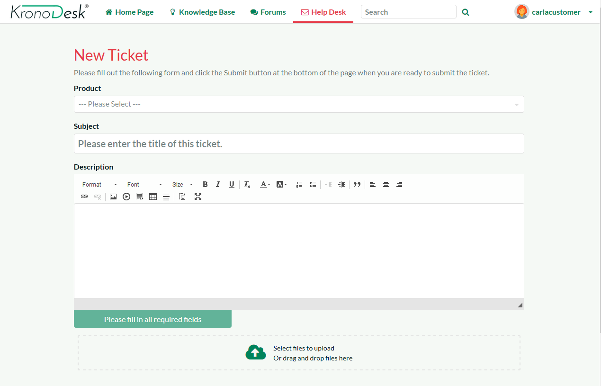
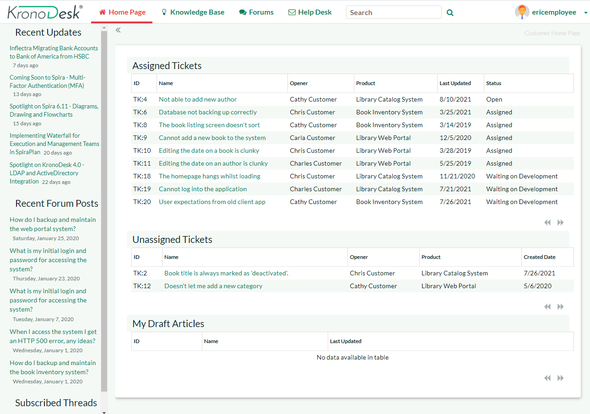
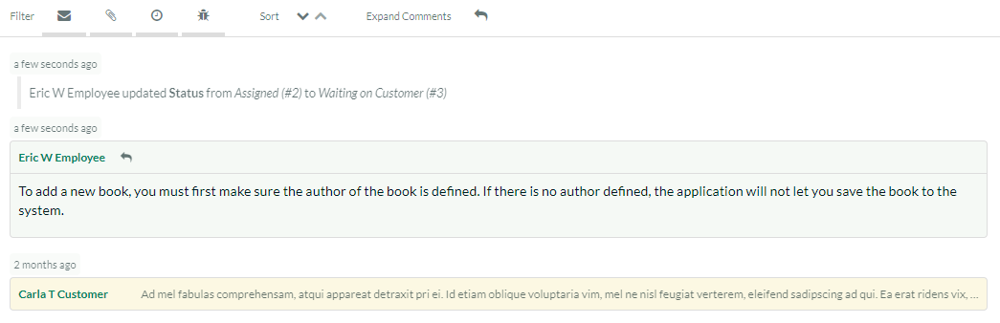
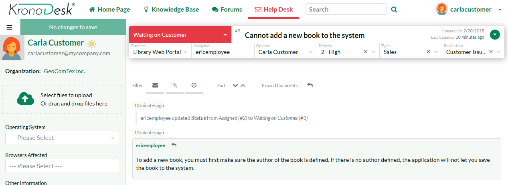
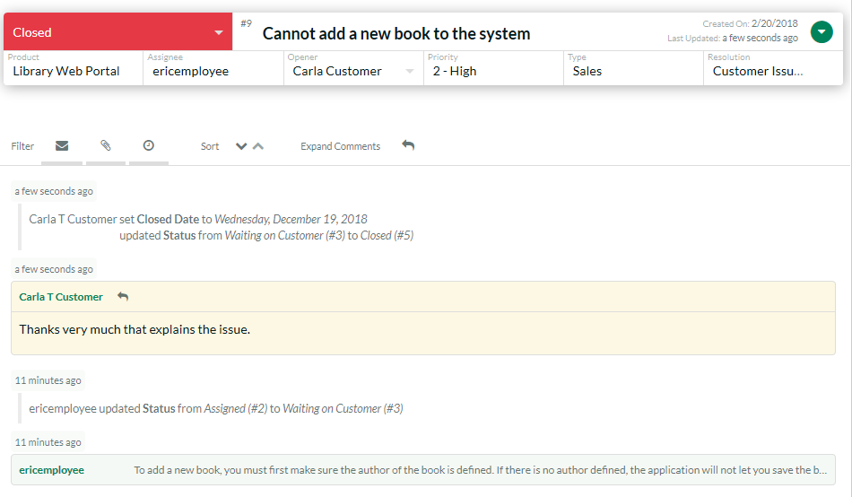
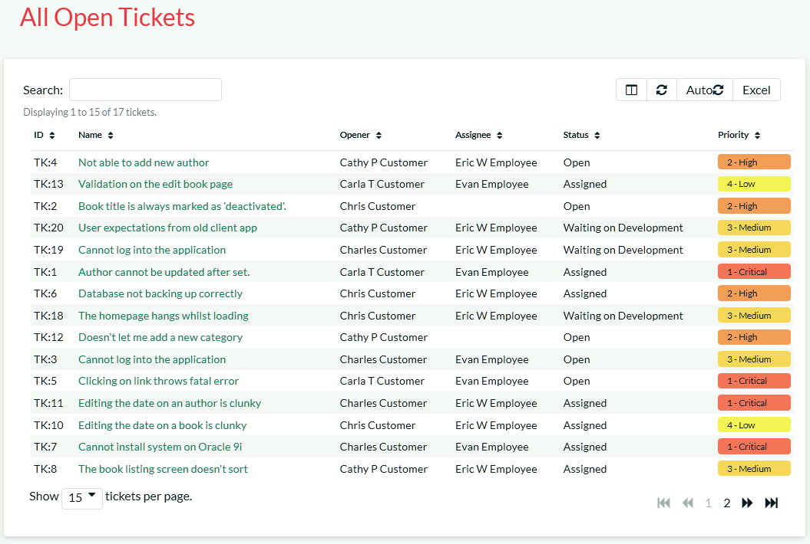

# Using the Help Desk Ticketing System

Once a user has looked at the public information, if they still cannot
find an answer to their problem they typically submit a help desk ticket
to the support team. This section shows you how to use the help desk in
KronoDesk.

## Submitting a New Ticket

First, login as a customer using the following credentials:

-   Login: carlacustomer

-   Password: PleaseChange

By default, his account role allows him to open support tickets, so you
should now see the 'Help Desk' menu item in the top navigation bar.
Clicking on it will reveal Chris's open tickets:

To submit a new help desk ticket, click on the 'Open Ticket' link in the
left-hand sidebar. This will bring up the page where basic information
can be added to a new ticket:

When you enter the title for the ticket, a list of potentially helpful
KB articles will be displayed:

If you see an article that may help you, you can click on it to open the
article in a new tab or window to review. If none of the KB articles
help, you can continue filling out the fields to submit a new support
ticket. Make sure you fill in all the required fields (the name and
description as well as those marked with an asterisk and shown in bold
-- Product, Operating System, Browsers Affected).

Go ahead and complete the support ticket and click "Submit". Once the
ticket is submitted, switch roles so you can simulate being the customer
service agent, responding to the ticket.

## Responding to a Ticket

You can create a ticket as an internal user or as a customer. Let's see
the experience from the customer's perspective. Click the 'Sign Out'
link and login as an employee using the following credentials:

-   Login: ericemployee

-   Password: PleaseChange

Once you have logged in you will see the employee dashboard. If you
don't see it right away, click on the 'Employee Home Page' link.

This view lets you see all of the help desk tickets assigned to you, as
well as any tickets that are not currently assigned to any support
agent, as well as other items you may have subscribed to or written.

Click on the main 'Help Desk' link and KronoDesk will provide you with a
filterable, sortable list of help desk tickets:

Make sure you have the list set to the 'Unassigned Tickets' view and
then select the new help desk ticket that you just submitted. Now choose
the option from the left sidebar menu 'Assign Ticket to Me'.
Alternatively, you can right-click on the ticket (long press on mobile
devices) and select 'Assign Ticket to Me'.) Once you have done that,
switch the view to 'My Assigned Tickets' and verify that the new ticket
has been assigned:

Now click on the hyperlink for the new ticket and you will see the
ticket details page:

This page lets you see all the details of the submitted ticket,
including custom fields (shown in the sidebar on the left). KronoDesk is
customizable to require different fields for each product and each stage
the ticket goes through.

Click on the status dropdown highlighted at the top where it is says
"Assigned". Assigned is the current status. Change the status to
'Propose Solution'. The options will vary depending on the current
status of the ticket, as defined in the application's Workflow. Add
comment that describes your proposed solution by clicking on any of the
reply buttons:

Once you are finished updating the ticket, click "Submit" and the ticket
will be returned to the customer (the status changes to 'Waiting on
Customer') and an email will be sent, notifying them of the change and
proposed solution.

Now that you have responded to the customer, you can log back in as a
customer to see how the response would be received.

## View Response as Customer

You need to click the 'Sign Out' link and login as the customer using
the original credentials:

-   Login: carlacustomer

-   Password: PleaseChange

This will then return you to the customer home page that displays a list
of your open help desk tickets:

You will see the ticket you had submitted is now 'Waiting on Customer'.
That means it is has either a clarifying question or a potential
solution from the support agent.

Click on the ticket title to display the response from the agent:

You can see on this page the original question / problem and the most
recent response, together with the complete contact history from the
customer and all the support personnel who have worked on this ticket.

Let's pretend that the solution worked and we want to close the ticket.
Click on the 'Change Status' dropdown, and select 'Close Ticket'. Enter
a note back to the agent, and then click 'Save'. The ticket will now be
closed.

Congratulations! You have submitted a help desk ticket, responded to it
as a support agent and then closed the ticket.

The last thing to demonstrate, is to see how a manager would log-in and
view/triage all the open help desk tickets.

## Searching for Tickets

You need to click the 'Sign Out' link and login as a manager using the
following credentials:

-   Login: marthamanager

-   Password: PleaseChange

Once you have correctly logged in you will see the employee dashboard.
Click on the main 'Help Desk' menu entry to display the manager-view.

As a manager-level user, you can view:

-   All the open tickets

-   All of the closed tickets

-   All tickets (open and closed)

In any of these three views you can sort and filter the list of tickets
by any of the columns displayed in the ticket list:

You can use the operations in the sidebar to bulk assign help desk
tickets to specific users, delete bad or duplicate tickets or merge
tickets together. Tickets can be selected by clicking on the row. To
select a range of tickets, click on the first ticket, then shift-click
on the last ticket. Control-Click to add or remove a ticket from the
selection.

