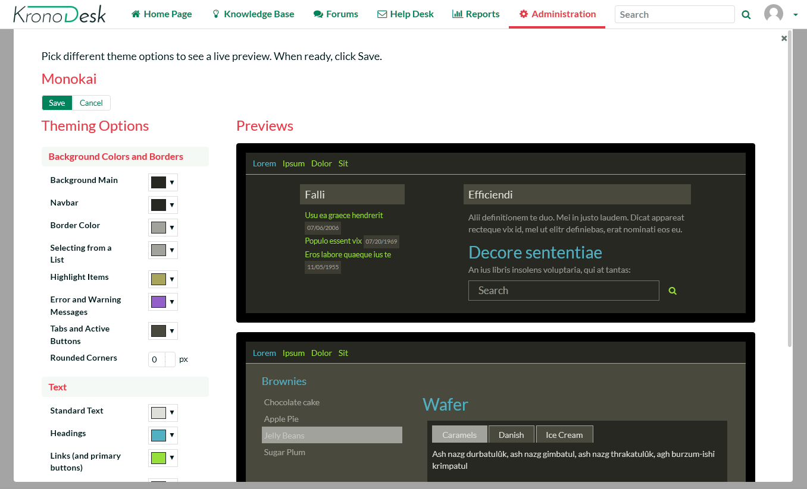

# Configuring and Customizing

You have now tried out KronoDesk both as a user viewing the knowledge
base and forums, as a customer submitting a help desk ticket, and as a
manager. This section describes the steps needed to configure the system
for real use by your organization.

To perform the configuration, you will need to login as the
Administration using these credentials:

-   Login: administrator

-   Password: PleaseChange

Once you have successfully logged-in, click on the Administration menu
item to bring up the Administration home page:

There are many different areas you can configure in the Administration
section. For example, you can customize the different ticket types,
statuses, and priorities, you can enter the various products, forums and
article categories you will need.

You can also disable sections of KronoDesk that you won't be using (for
example, some of our customers don't need a public forum). These are all
described in more detail in the *KronoDesk Administration Guide*.

The next sections will illustrate a couple of important setup steps that
you will need to perform before you start using KronoDesk for real.

## Configure Branding

Under System Settings \> Appearance, you will have two tabs. The first
tab, 'Appearance', will let you select one of the pre-installed themes,
or edit a theme to customize the applications appearance to match your
company color scheme. The edit theme page will let you set various
colors for different parts of the application:

The second tab, 'Branding', will let you set certain text and page
names. In this section you should change the name of the site from
'KronoDesk' to your company name, enter in the email address, phone
number and other information that you'd like to describe your support
site.

This page lets you change the color scheme of KronoDesk, upload your
company logo (full size image for desktop devices and a smaller icon for
use on the mobile version) and generally change how it will look.

For example, we use KronoDesk ourselves and we have rebranded it as
follows:

## Remove Sample Data & Start Using

Finally, once you are ready to start using KronoDesk, you will want to
delete all of the sample categories, products, forums, threads,
articles, help desk tickets and users, and then create your own
categories and settings.

To do that, go to 'System Settings \> Remove Sample Data'. Click on the
'Remove Sample Data' button to confirm your decision:

Congratulations, you are now ready to use KronoDesk. You can now add
users, products and forums.

For more information about any of the features, please refer to the
[*KronoDesk User
Manual*](http://www.inflectra.com/Documents/KronoDesk%20v2.0%20User%20Manual.pdf)
or the [*KronoDesk Administration & Install
Guide*](http://www.inflectra.com/Documents/KronoDesk%20v2.0%20Administration%20Guide.pdf).

