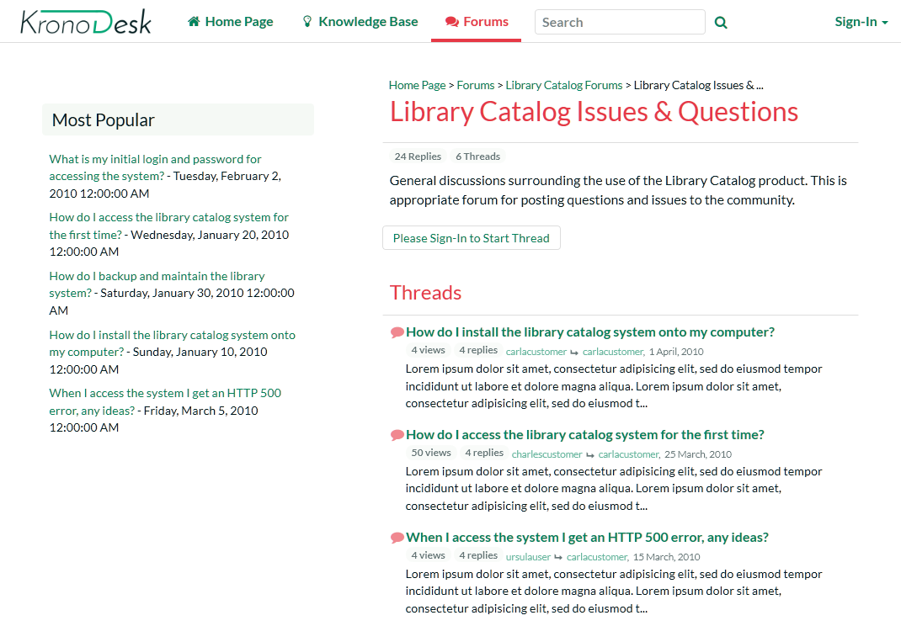

# Getting Started

Once you have either downloaded and installed a trial version of
KronoDesk or signed up for a hosted trial, you should be able to see the
following home page in your web browser:

This is the view of the system that a guest user would see of the
system. As you can see it displays some general help information for
them as well as a list of recent articles, forums posts, company news
and popular articles.

Before logging in as an administrator and showing you how to add new
articles, forum posts and help desk tickets, let's start by seeing what
information a guest user can see.

## Viewing Knowledge Base Articles

When a user has a problem and needs help, their first level of support
would be to look for a pre-written knowledge base (KB) article that has
been written by a support agent.

Users can find articles either by searching or by browsing the available
topics. To search, enter a search term (for example, "error message") in
the KB search box:

This will automatically display a drop-down list of matching articles:

The user can then click on an article to view it, or click on the
'browse' link to view articles organized by category:

Users can navigate to the category they are interested in, view articles
for that category, or drill down into sub-categories. They can also
click one of the top tags used in the articles, to view all related
articles:

Another way to search the knowledge base is to enter your search into
the global search box at the top of the screen and click the search
button to the right. KronoDesk will display a list of articles (and
other matching items) in the results window:

Clicking on one of the articles in the search results will bring up the
full text of the article.

## Browsing the Support Forums

If you were unable to solve your problem by finding a matching article,
your next option is to look into the forums to see if another user has
experienced the same problem.

Click on a specific forum (e.g. Library Catalog Issues & Questions):

KronoDesk will display the list of threads in the forum you selected.
The list is sorted with the most recent threads at the top. Click on one
of the threads (for example "How do I install the library catalog system
onto my computer?") to display the full conversation:

KronoDesk displays the original message together with replies by
different users. If a user wants to reply to the thread they will be
prompted to login first (if they are not already logged in).

If you are interested in this topic, you can click on the breadcrumb
links at the top of the page to find other threads in the same forum or
category. In addition, you can click on one of the meta tags to display
a list of other related threads (that may be in a different forum or
category altogether):

