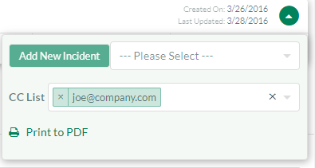
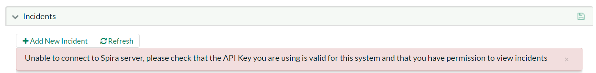
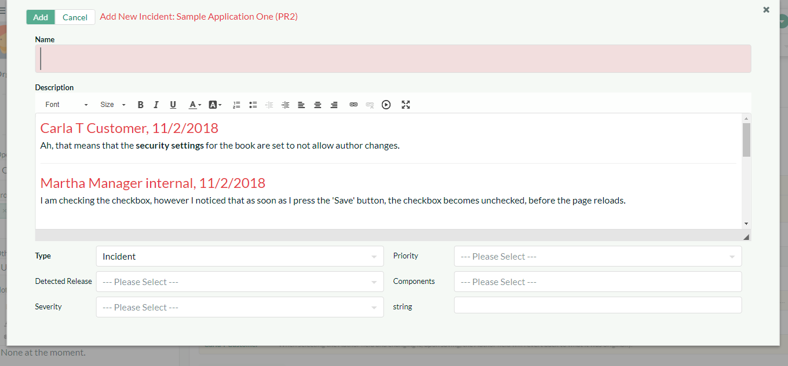

# Help Desk

The KronoDesk® help desk ticket management system provides the final level of customer support. When a customer cannot readily find the solution through either the knowledge base or support forums, they can submit a help desk ticket through KronoDesk's help desk submission system. The system allows them to quickly and easily enter the description of the problem, attach any relevant documents or screenshots, categorize the issue and then submit it for resolution by the support agents.

## Ticket List

When you click on the Help Desk option in the global navigation, you will be taken to the main help desk page:

This page displays on the left-hand side a list of display options for viewing the help desk. The available options will depend on your role in the system. In general customers can only see their submitted tickets whereas customer support agents can see all the tickets in the system.

The following display options are available to external users:

-   **My Opened Tickets** - This displays a list of all the open tickets that were opened by the current user.
- **My Closed Tickets** - This displays a list of all the closed tickets that were opened by the current user.
- **Organization Tickets** - This displays a list of all the open tickets that were opened by anyone in your organization (only displays for users who are a member of an organization).

The following display options are available to support agents:

- **My Assigned Tickets** -- This displays a list of all the open tickets assigned to the current user.
- **Unassigned Tickets** - This displays a list of all the open tickets that are not assigned to any support agents.
- **All Open Tickets** -- This displays a list of all the open tickets regardless of who opened them or who they are assigned to.
- **All Closed Tickets** - This displays a list of all the closed tickets regardless of who opened them or who they are assigned to.
- **All Tickets** - This displays a list of all the tickets regardless of their status, who opened them or who they are assigned to.

If you are using [support agent groups](../Administration-Guide/Users/#manage-employee-groups), you will also see the following two additional options:

- **Group Open Tickets** - This displays a list of all the open tickets that have been assigned to a specific employee group.
- **Group Closed Tickets** - This displays a list of all closed tickets that have been assigned to a specific employee group.

When you choose one of the 'group' views, there is a dropdown list that is displayed on the top of the page that lets you select which group to view tickets for:

In addition, there is an Operations pane that is displayed for support agents and lets you perform the following tasks:

- **Assign Tickets to Me** -- If you select ticket(s) in the main grid and then click this option, it will assign the selected tickets to your user.
- **Assign Tickets to User** -- If you select ticket(s) in the main grid and then click this option, it will allow you to assign the selected tickets to a specific customer agent.
- **Unassign Tickets** -- If you select ticket(s) in the main grid and then click this option, it will return the ticket to the unassigned list.
- **Merge Tickets --** If you select two or more tickets in the grid (using SHIFT+click or CTRL+click) then click merge, the system will combine them into a single ticket for you.
- **Delete Tickets** -- If you select ticket(s) in the main grid, then click this option, it will permanently delete the selected tickets. Typically this is only used for tickets generated from spam emails.

### Filtering and Sorting

The main ticket grid allows you to filter and sort the ticket list. You sort a column by simply clicking on the arrow in the header row. To filter the ticket list, simply enter the text into the search box and the ticket list will be automatically filtered:

If you want to undo the filter, simply clear the filter and the full ticket list will be displayed.

### Changing Columns

To show and hide different columns in the ticket grid, click on the columns icon above the grid and the column selector will be displayed:

Once you have chosen the columns to display or hide simply click away from the dialog and the column selector will close and the grid will be reloaded with the new columns.

### Auto-Refreshing

Sometimes as a support agent it is useful to have the ticket list auto-refresh every couple of seconds to ensure that you are seeing the most up-to-date information. Clicking on the "Auto Refresh" icon will enable this feature.

### Export to Excel

To export the current list of tickets to an Excel Comma Separated Values (CSV) file, simply click on the 'Excel' icon and the current ticket list will be exported into an MS-Excel compatible CSV file:

### Context Menu

KronoDesk® provides a handy shortcut for performing frequent operations on the ticket list. Simply hover the mouse over the ticket grid and click the right mouse button. This brings up the context menu:

You can use this to perform the following operations:

-   **Assign Tickets to Me** -- If you select ticket(s) in the main grid and then click this option, it will assign the selected tickets to your user.

-   **Assign Tickets to User** -- If you select ticket(s) in the main grid and then click this option, it will allow you to assign the selected tickets to a specific customer agent.

-   **Unassign Tickets** -- If you select ticket(s) in the main grid and then click this option, it will return the ticket to the unassigned list.

-   **Merge Tickets --** If you select two or more tickets in the grid (using SHIFT+click or CTRL+click) then click merge, the system will combine them into a single ticket for you.

-   **Delete Tickets** -- If you select ticket(s) in the main grid, then click this option, it will permanently delete the selected tickets. Typically this is only used for tickets generated from spam emails.

## Create New Ticket

If you click on the hyperlink to "Open Ticket", the system will display the new help desk ticket entry page:

This page displays the following information:

-   **Opener** -- When a customer support agent opens a ticket, they are opening it on behalf of a customer (for instance during a phone call). You can type a name, email address, or organization name into this field to get a list of possible matches. When a customer opens a ticket they do not see this field.

-   **Product** -- Each ticket has to be assigned to a specific product, which can be selected from the dropdown list

-   **Subject/Description** -- This section of the page allows you to enter the subject and long description of the customer's support issue. The long description allows formatted text and can include lists, tables and hyperlinks.

-   **Ticket Fields --** This section displays all the fields that need to be filled out when submitting the ticket. The fields that are required are displayed in **bold type** with an asterisk(\*) next to the field name. When you change the product name field that may change the workflow associated with the ticket. If that happens, you will see some of the fields change. This is normal and allows the administrator to tailor the fields required to the type of product (e.g. a web application may need you to enter the browser type, whereas a mobile application would need to know the cellphone network)

-   **Attachments** -- This section is described in more detail below in
[Adding a Document Attachment](#adding-a-document-attachment)

Please note that when a customer is creating a ticket, KronoDesk will dynamically search the knowledge base to see if there are any articles that could answer their question, based on what they enter as the ticket's subject:

### Adding a Document Attachment

You can drag and drop files onto the attachment area:

As you add documents, they will appear in this control. To add a new attachment to the ticket, either drag and drop the files onto this control or click on the arrow to browse your local file system. Once the documents are attached they will be listed below the attachment area:

You can remove any items by selecting the item and clicking the "Delete Selected" x.

*Note: The system uses file extensions to identity the type of file, so if your local operating system doesn't use file extensions, you may want to rename the file before uploading (e.g. changing MyDocument to MyDocument.pdf to identity it as an Acrobat document).*

### Adding a Screenshot

To include a screenshot in your ticket, first copy the image to your computer's clipboard (e.g. on Windows computers, the PRINT SCREEN button captures the current page and adds to the clipboard). Once the image is in the clipboard, position the cursor in the ticket Description text box where you want it to appear and then click CTRL+V to paste the image.

The image will then be attached to the ticket and embedded in the rich text box.

## Ticket Details

If you click on the hyperlink for a specific ticket in either the main ticket list page, one of the user dashboards, or the navigation sidebar, you will be taken to the details page for the specific ticket:

This page is made up of three areas; the sidebar (left), the header (top right), and the journal (bottom right).

The sidebar has two views. In both views there is a submit button at top. By default the sidebar shows:

-   information about the opener of the ticket

-   an uploader area

-   a list of custom fields

The alternate view of the sidebar is to show lists of relevant tickets to the user and can be used to quickly jump to other tickets. You can switch between these two views at any time by clicking the button in the top left (just to the left of the submit button).

The header contains the ticket name and other important meta-data.

The journal contains information associated with the activity taken over the course of the ticket. There are up to four types of data that the journal shows. Each user can show or hide the information based on their needs, by clicking the filter buttons, or change the sort order to be by date ascending or descending.

The four types of information shown in the journal:

-   **Notes --** the description of the original ticket plus a list of all the notes added by support personnel and the original submitter.

-   **Attachments** -- any file added to the ticket

-   **Incidents** -- If you have the integration with SpiraTeam®
enabled, you will see any incidents (defects, bugs, change requests, etc.) related to the current ticket.

-   **History** --shows you the change history for the ticket.

### Changing Fields and Statuses

When editing an existing ticket, the fields that are available and the fields that are required will depend on your stage in the ticket workflow. For example, an open ticket might not require an "Assignee" whereas an assigned ticket typically would not. The types of change allowed and the email notifications that are sent will depend on how the system administrator has configured the workflow. Administrators should refer to the *KronoDesk Administration Guide* for details on configuring the ticket workflows to meet their needs. The workflow controls both the meta-data fields shown in the header, as well as any custom fields shown in the sidebar.

Depending on the user's role and whether they are listed as the opener or assignee of the ticket, displayed in the top-left of the header, is a dropdown list with the allowed workflow operations:

These workflow transitions allow the user to move the ticket from one status to another. For example in the default workflow, when the ticket is in the Assigned status, you will be given the options to change the status to one of:

-   "Open"

-   "Waiting on Customer"

-   "Waiting on Development"

-   "Duplicate"

-   "Non-Issue"

After changing the status of the ticket by clicking on the workflow link, you can then fill in the additional fields that are now enabled and/or required. Once you've made the changes to the appropriate ticket fields, click on the "Submit" button in the sidebar (at the top left of the screen).

Some transitions may require a digital signature. In the workflow dropdown, those transitions will be marked with a lock symbol. Upon saving, you will be given a prompt:

You must re-enter in your password, and an additional reason/meaning for the transition before the application will allow you to save your changed.

### Using the Journal to view comments

The journal displays the entire history of a ticket, and most importantly all communication between agents and the customer. All messages from customers are shown in one color background (pale yellow in the default application theme). All messages to customers from agents are in a different color (light gray in the default application theme). Clicking at the top of each message / note will expand or collapse that note, to help scrolling through long tickets, or reviewing new information. Using the button at the top of the journal, you can also expand or collapse all comments at once.

Here all comments are expanded:

And here they are all collapsed:

Any notes that are 'internal only' and therefore only visible to customer support agents, are displayed with a red background (in the default application theme) with a mute icon at the top left:

### Adding Notes

You can reply to a ticket at any time by clicking the reply button in the journal toolbar (the rightmost button):

You can also reply using any reply button on any expanded ticket note. This will show the reply window directly underneath that note. You can even start replying to one note and then click on another note to move the reply window to that second note. The new note / reply will always get added to the ticket in the same way, but it can be helpful to
'attach' the reply window to a specific note you need to refer to in a reply.

You need to enter the note text in the rich-text box. As soon as you do you will see the button to the bottom left of the reply window become active and say "Submit". Click this will save all changes to the ticket and add the note to the ticket at the same time.

If you would like to insert a Knowledge Base (KB) article into your reply to the user, you can click on the link "Add KB to Note" (this is only visible to agents):

You then select the KB article from the available list, choose the type of link to insert (name and link only, full article text, etc.). Then click the 'Insert Template' to populate the note with the KB article link/text. There are a number of templates you can use. These are all configurable by the application administrator.

To include a screenshot in your note, first copy the image to your computer's clipboard (e.g. on Windows computers, the PRINT SCREEN button captures the current page and adds to the clipboard). Once the image is in the clipboard, position the cursor in the Note text box where you want it to appear and then click CTRL+V to paste the image.

The image will then be attached to the ticket and embedded in the note text.

### CC's to a Ticket

With KronoDesk's cc functionality, a user can make sure other interested parties are copied in to all email notifications about a ticket. If a user creates a ticket via email and adds cc's to that email, they will automatically be added as a cc to the ticket.

You can tell that a ticket has cc's on them by looking at the ticket header -- there is a cc badge to the left of the ticket name:

To view and edit the cc's on the ticket (any valid email address can be used), click on downward facing arrow on the right hand side of the ticket header (the "more actions" button).

### Attachments

The attachments pane of the sidebar gives a drag and drop area for adding files to a ticket. Files added in the current editing session (before clicking "Submit") are shown below the attachment pane. Older files are shown in the journal. The documents can be in any format, though KronoDesk® will only display the icon for certain known types:

The attachment list includes the filename/URL that was originally uploaded together with the file-size (in KB), name of the person who attached it and the date uploaded.

To actually view the document, simply click on the filename hyperlink and a new web browser window will open. Depending on the type of file, this window will either display the document / web-page or prompt you for a place to save it on your local computer. To remove an existing attachment from a ticket, simply select the item and click the
\[Delete\] button.

To attach a new document to the ticket, you simply drag them onto the attachment upload control or click on the upload button and then browse to find the file on your local filesystem.

*Note: The system uses file extensions to identity the type of file, so if your local operating system doesn't use file extensions, you may want to rename the file before uploading (e.g. changing MyDocument to MyDocument.pdf to identity it as an Acrobat document).*

### Incidents

SpiraTeam® incidents linked to the current help desk ticket are shown in the journal (as long as the current user has permission to view them). If you see the following message, it means that your user profile in KronoDesk has not been linked to an equivalent SpiraTeam user profile. To fix the issue, click on the "user profile" link and enter your SpiraTeam RSS Token into your KronoDesk user profile. This is described in more detail in [Edit Profile](../User-Profile/#edit-profile)

Once your KronoDesk user is linked to a corresponding SpiraTeam user, you will see a list of SpiraTeam incidents that were generated from the current ticket in the journal, organized with other journal items based on the date the incident was created:

Each incident is displayed together with its incident ID, name, status, owner, and last update date. Hovering over the incident name will give a tooltip of the incident description. Clicking on the incident name/hyperlink will open the incident in SpiraTeam in a new window.

This allows support agents to view the status of the incidents use it to determine when the ticket can be resolved because the underlying product issue has been resolved.

To log a new incident in SpiraTeam based on the current help desk ticket, click on downward facing arrow on the right hand side of the ticket header (the "more actions" button).

To "Add New Incident" make sure a SpiraTeam project is selected from the dropdown list (if the name of the product for the ticket matches the name of any Spirateam project, that project will be automatically selected for you):

This dialog lets you add a new incident to the linked instance of SpiraTeam. The system will prepopulate the description of the incident with the ticket description. You can edit this text or clear it completely and enter in custom content.

You then need to enter an incident name, and choose values for other fields based on what fields are required (this is set inside SpiraTeam on a project by project basis). Once you are satisfied, click "Add" to add the incident to SpiraTeam. Once the incident has been added, it will appear in the KronoDesk journal.

*Note: You need to make sure that the SpiraTeam user that you have associated with your KronoDesk profile has permissions to create new incidents in that project in SpiraTeam.*

### History

The journal displays the list of changes that have been performed on the help desk ticket artifact since its creation. An example ticket change history is shown below:

The change history displays the date that each change was made, together with the fields that were changed, the old and new values and the person who made the change. This allows a complete audit trail to be maintained of all changes in the system.

### Navigating tickets using the sidebar

When viewing the sidebar as a list of tickets, you will see links to take you back to the ticket list and to create a new ticket. There will also be a list of peer tickets to the one selected. This latter list is useful as a navigation shortcut; you can quickly view the peer tickets by clicking on the navigation links without having to first return to the ticket list page. The navigation list can be switched between four different modes:

-   The list of tickets matching the current filter

-   The list of all tickets, irrespective of the current filter

-   The list of tickets assigned to the current user

-   The list of tickets opened by the current user

### Working More Efficiently Using Keyboard Shortcuts

Press the question mark symbol on your keyboard to bring up a list of available keyboard shortcuts. These should allow you to operate the entire ticket details page without requiring a mouse and can greatly speed up your workflow as you reply to, and manage your tickets.

