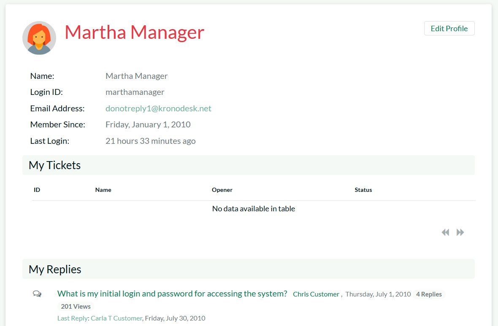
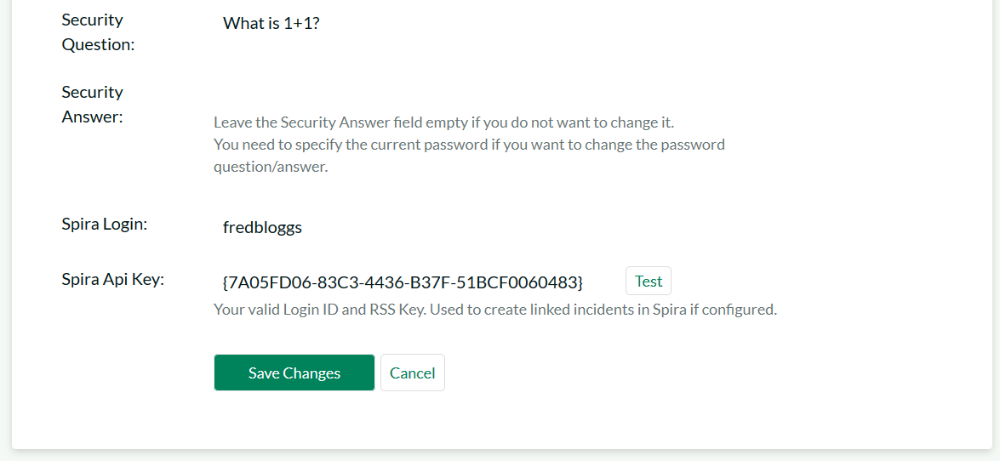
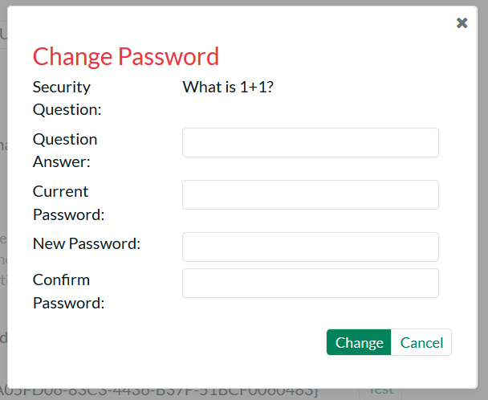
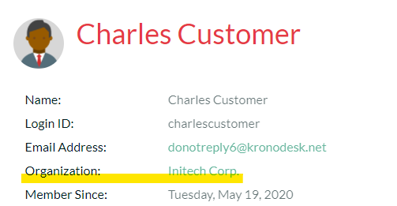
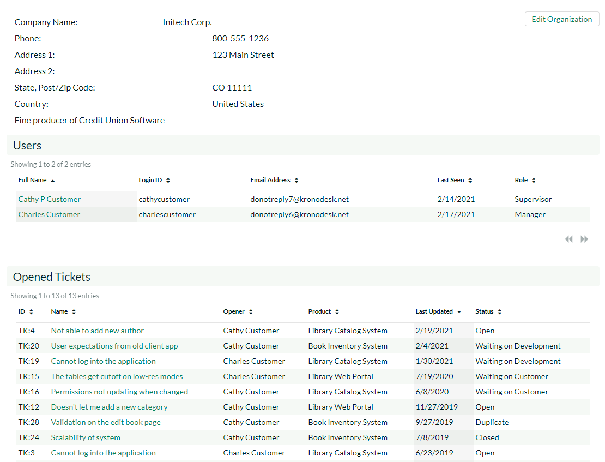

# User Profile

To update your user's profile, view your list of tickets, threads/replies, draft KB articles or change your password, simply click on your username in the top-right of the application header. The system will then display the user profile home page:

This page will display your user's name, login, email address, date of registration, culture/locale, timezone, linked SpiraTeam login and RSS Token (also known as the API Key), avatar image and a list of the roles that your user belongs to.

Underneath this section the system will display a list of help desk tickets, draft KB articles, forum threads and thread replies that you have posted. To edit your profile, click on the 'Edit Profile' button.

## Edit Profile

If you click on the "Edit Profile" button, it will bring up the following dialog:

You can update the following fields on this page:

-   **Login ID** -- the username that you'd like to use in the system. This has to be unique.

-   **Email Address** -- a valid email address that notifications will be sent to.

-   **First Name** -- your first name

-   **Last Name** -- your last name

-   **Middle Initial** -- your middle initial (if applicable)

-   **Culture/Locale** -- choose a specific culture/locale for your user. This will determine which language pack is used by the application and what date format is used

-   **Timezone** -- choose a specific timezone for your user. This will determine the timezone that dates will be displayed in the application

-   **RSS Token** -- used to allow you view secure KronoDesk RSS newsfeeds from outside the system

-   **Password** -- enter your current password if you plan on changing the password question/answer. If you don't need to change the password question/answer, you can leave this blank.

-   **Security Question/Answer** -- enter a question that only you will know the answer to, together with the matching answer to that question.

-   **Spira Login** -- You need to enter a valid login for SpiraTeam that corresponds to your user. This allows you to view SpiraTeam incidents linked to a specific KronoDesk help desk ticket.

-   **Spira Api Key** -- You need to enter the SpiraTeam RSS token (also known as the API-Key) for the SpiraTeam user specified above.

-   **Avatar** - Each user in KronoDesk can have a small graphic icon (called an avatar) associated with their account. This icon will be displayed next to forum posts, ticket comments, etc. You can click on the \[Browse\] button to change your avatar or \[Remove\] to switch your user back to the default image.

Once you are satisfied with the changes, you can click \[Update User\]
to commit the changes.

## Change Password

If you click on the "Change Password" button you can update your password

You need to enter the old password and the new password twice. Assuming that the old password matches your current password and that the two instances of the new password match, the system will change your password.

## Organizations

Customers can be assigned to an organization (one max). To create and manage organizations you must be an administrator - as described in the [system admin organization section](../../Administration-Guide/Users/#manage-organizations).

When you are part of an organization you will have one of three roles:

-   **Member**: you can view company information, see who else is a member of the organization, and view open tickets by other organization members
-   **Supervisor**: all of the above, plus you can edit any open tickets, including add replies
-   **Manager**: all of the above, plus remove and add user accounts from/to the organization, as well as modify other organization properties

The user profile shows an Organization entry - this tells you that you are in an organization. 

Click on the organization name to open the organization page. Here you can see:

- Organization information
- A link to edit the organization information (if your role allows)
- Members of the organization
- All tickets the organization has opened - this includes currently open tickets and closed tickets

To manage currently open tickets across your organization go to the [main help desk page](../Help-Desk/#ticket-list) and use the **Organization Tickets** display option in the sidebar.