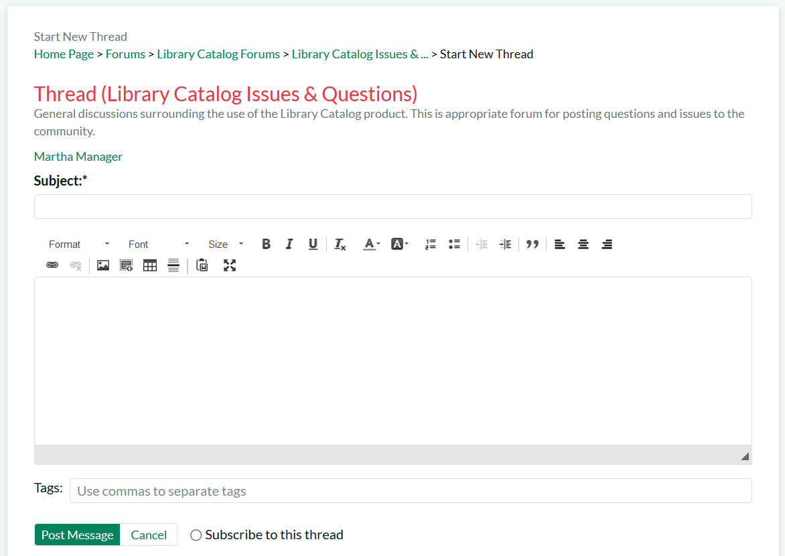
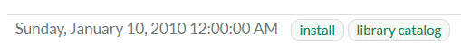
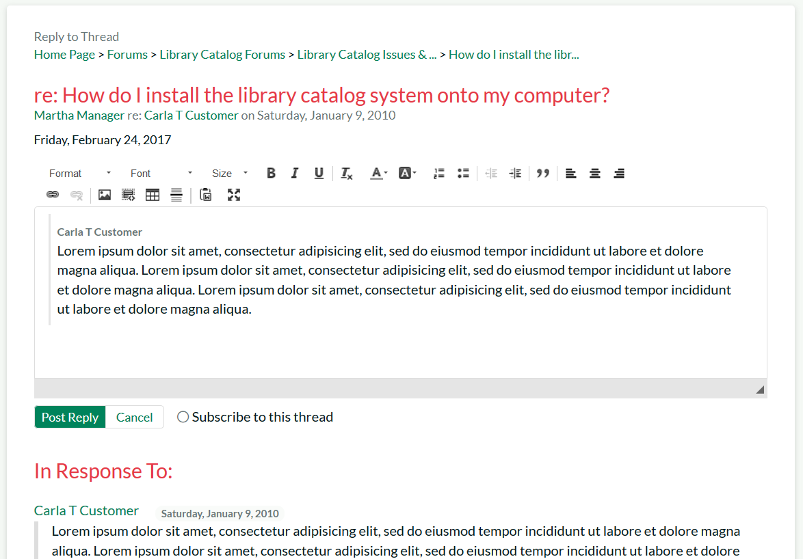
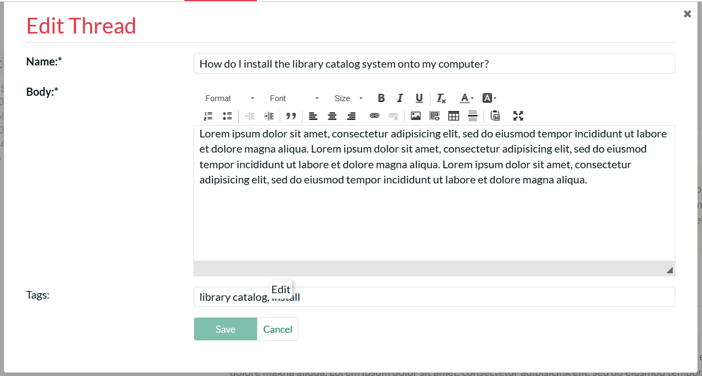

# Forums

The KronoDesk® support forums provide the next level of support to
customers. Where a fully codified knowledge base article has not yet
been synthesized and created by the support agents, the support forums
provide a place where users can search for existing messages concerning
the same problem. The support forums thereby provide a community where
customers and support agents can post replies to common questions
visible to the entire community.

## Category List

When you click on the Forums option in the global navigation, you will
be taken to the forum home page that displays a list of all the
categories and associated forums, together with widgets that display
recent posts, and a tag cloud:

Each category will be displayed together with the list of active forums
in the category. Each forum will be displayed along with the number of
threads and replies in the forum as well as information describing the
last post made in the forum.

If the forum icon is filled-in, it means that there is at least one new
thread or reply in the forum that you have not already read. If the
forum icon is not filled-in, it means that there are no new forums or
replies since the last time you visited.

### Tag Cloud

The tag cloud displays a list of all the tag names associated with forum
threads in the system. The size of the font is proportional to the
number of threads associated with the tag. Clicking on a tag name will
take you to the following page that lists all the threads that have been
tagged with the specific tag:

### Recent Posts

This widget displays a list of the most recent forum posts in the
system, including the name and date of the post. Positioning the mouse
over the title will display a popup tooltip containing the long
description of the post.

## Category Details

If you click on the name of a category, it will bring up the category
details page:

This page displays the selected category together with a list of active
forums in the category. Each forum will be displayed along with the
number of threads and replies in the forum as well as information
describing the last post made in the forum. The **Recent Posts** widget
will also be filtered to only include threads/posts from the current
category. The **Tag Cloud** will show tags from all categories.

If the forum icon is filled-in, it means that there is at least one new
thread or reply in the forum that you have not already read. If the
forum is not filled-in, it means that there are no new forums or replies
since the last time you visited.

## Forum Details

If you click on the name of a forum, it will bring up the forum details
page:

This page displays all the threads in the selected forum, together with
the number of replies to the thread, the number of times the forum has
been viewed and a description of the most recent reply to the thread.

If the thread icon is filled-in, it means that there is either a new
thread or there is at least one new reply that you have not already
read. If the thread is not filled-in, it means that you have already
viewed the thread and that there are no new replies since the last time
you visited.

If you click on the RSS icon, you can subscribe to the current forum in
an RSS-compatible newsreader. If you click on the "Subscription"
hyperlink underneath the forum title, the forum will be added to your
list of subscribed forums. Whenever a new thread is posted or a new
reply occurs, you will receive an email notification.

In addition, the **Most Popular** widget displays a list of the forum
threads that have been most frequently viewed by users of the system.
Each thread is displayed with its title and date of publication.
Positioning the mouse over the title will display a popup tooltip
containing the long description of the thread.

### Starting a New Thread

If you are logged in as an authenticated user, you can click on the
"Start New Thread" hyperlink to create a new forum thread:

You need to enter the subject, description and meta-tags for the new
thread. Once you are satisfied with your submission you should click the
"Post Message" hyperlink to add the new thread to the forum. If you
would like to subscribe to the new thread (and thereby get notified when
someone replies), make sure to check the "Subscribe to this thread" box
before submitting.

## Thread Details

If you click on the name of a thread in the thread list, it will bring
up the thread details page:

This page displays the subject and description of the thread together
with a list of replies from different users. Each reply will be
displayed along with information that describes whether the reply is a
direct response to the thread itself or a reply to one of the other
replies.

If you click on the RSS icon, you can subscribe to the current thread in
an RSS-compatible newsreader. If you click on the "Subscribe" hyperlink
underneath the thread title, the thread will be added to your list of
subscribed threads. Whenever a new reply occurs, you will receive an
email notification.

The tags section under the heading displays a list of the meta-tags
associated with the current thread:

Clicking on the meta-tag name will automatically take you back to the
thread search page where you can see a list of other threads that have
been tagged with the same keyword.

Depending on your role, you will see different operations available for
the thread and each of the individual replies:

-   **Reply** -- this allows you to reply to the thread or a specific
message (see below)

-   **Quote** -- this allows you to reply to the thread or a specific
message, quoting the text (see below)

-   **Edit** -- this allows you to make changes to the thread or reply
(see below)

-   **Delete** -- this will delete the thread or reply

### Reply to Thread

When you click on the "Reply" hyperlink it will display the following
dialog:

You need to enter the description of your reply to the original post.
Once you are satisfied with your submission you should click the "Post
Reply" hyperlink to add the new response to the thread. If you would
like to subscribe to the thread (and thereby get notified when someone
replies), make sure to check the "Subscribe to this thread" box before
submitting.

### Reply to Thread with Quote

When you click on the "Quote" hyperlink it will display the following
dialog:

You need to enter the description of your reply to the original post.
The original post or reply will be displayed inside a grey box. You can
delete some of the text inside the box so that you can make it clear
which part of the original message you are responding to.

Once you are satisfied with your submission you should click the "Post
Reply" hyperlink to add the new response to the thread. If you would
like to subscribe to the thread (and thereby get notified when someone
replies), make sure to check the "Subscribe to this thread" box before
submitting.

### Editing a Thread/Reply

When you click on the "Edit" hyperlink it will display the following
dialog:

This page lets you edit a specific thread or reply in the forum. You can
edit the subject, body and tags of the message. Once you are satisfied
with your changes, click the \[Save\] button to commit the changes.

