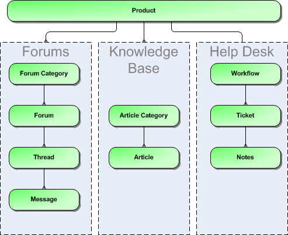
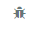

# Functionality Overview

This section outlines the functionality provided by KronoDesk® in the
areas of help desk ticketing, customer support forums, online knowledge
base and user account management.

## Dashboards

When a customer first accesses KronoDesk, they are taken to the
KronoDesk Customer Homepage. This page is designed to provide them with
an easy to use starting point for resolving their support issue. They
are provided with tools for searching the online knowledge base, asking
questions in the support forums and a link to create a help desk ticket.

The dashboard also includes recent knowledge base articles, news
updates, and recent forum posts so that they can keep on top of recent
development and contribute back into the support community.

For customer service agents, the Employee Homepage provides them with a
consolidated view of their assigned tickets, any tickets not current
assigned, recent forum posts, and current news updates so they can see
all inbound requests from customers in one single place, ensuring that
they are able to monitor the support forums and help desk from a single
screen.

## Knowledge Base

The KronoDesk® online knowledge base provides the first level of support
to customers. Instead of having to constantly respond to the same
routine enquiries and support requests, customer support agents can use
the built-in knowledge base to create articles related to different
topics, categories and products. Knowledge base articles can be linked
to multiple categories and also tagged with meta-tags to make searching
easier by customers. The system includes full rich-text editor so that
articles can be formatted with lists, tables, different text styles and
embedded hyperlinks.

## Support Forums

The KronoDesk® support forums provide the next level of support to
customers. Where a fully codified knowledge base article has not yet
been synthesized and created by the support agents, the support forums
provide a place where users can search for existing messages concerning
the same problem. The support forums thereby provide a community where
customers and support agents can post replies to common questions
visible to the entire community.

This provides a faster turnaround for customers who can find immediate
solutions to their issues and enables the support agents to focus their
time on dealing customer issues that have not been previously
encountered or customers issues that particularly complex or
environment-specific.

## Help Desk Ticketing

The KronoDesk® help desk ticket management system provides the final
level of customer support. When a customer cannot readily find the
solution through either the knowledge base or support forums, they can
submit a help desk ticket through KronoDesk's help desk submission
system. The system allows them to quickly and easily enter the
description of the problem, attach any relevant documents or
screenshots, categorize the issue and then submit it for resolution by
the support agents.

The customer support agents can use the help desk system to review
incoming tickets, assign them to themselves or other support agents as
needed, provide suggestions to the customer, or escalate to the next
level of support. They can use the system to add notes to the ticket,
change the fields, or ask for more information. Any changes made to the
ticket will be notified to the customer so that they're kept abreast of
changes to their ticket. In addition, the customer can use their
customer homepage to see a list of their open tickets together to see at
a glance what action has been taken and what recommendations have been
made.

## User Account Management

KronoDesk® supports the management of an unlimited number of users,
which can be administered through the same web interface as the rest of
the application, and each user of the system can be given a specific
role in the system. In addition, each user has a secure Account
management section of the application where they can update their
personal information, manage their subscriptions and change their
password information.

In addition to these administration functions, each user has their own
personalized dashboard view of all the pertinent and relevant
information. This feature reduces the information overload associated
with managing such a rich source of information, and allows a single
customer and employee snapshot to be viewable at all times for rapid
decision-making.

## Miscellaneous

### Artifact Relationships

The sections above have outlined the different features and functions
available in the system, and have described the various artifacts
managed in the system (e.g. tickets, articles, forums, threads, etc.).
To aid in understanding how the information is related, the following
diagrams illustrates the relationships between the different artifacts
and entities:

***Figure 1: The relationships between the various KronoDesk entities***

With these overall concepts in mind, the rest of this help manual will
outline the functionality in each of the KronoDesk® screens, and provide
specific information on how to manage each of the artifacts illustrated
above. Note that this manual does not explain the Administration-level
functionality of the system; for that, please refer to the *KronoDesk®
Administration Guide*.

### Artifact Naming Conventions

On various screens in the system, you will see lists of artifacts
(tickets, articles, etc.) together with a unique identification number.
In order to make it easier to recognize at a glance which type of
artifact the identification number refers to, KronoDesk uses a system of
two-letter prefixes which help identify the type of artifact being
displayed. The current prefixes used by the system are:

**Artifact**        **Prefix**   **Artifact**             **Prefix**
Ticket              TK           Knowledge Base Article   KB
Ticket Status       TS           User                     US
Ticket Type         TT           Forum                    FR
Ticket Priority     TP           Thread                   TH
Ticket Resolution   TR           Message                  MG
Product             PR                                    

In addition, certain artifacts in the system are displayed with an icon
that helps distinguish them from each other, and provides additional
context on the state of the artifact:

**Icon**                                                                                            **Artifact Description**

                             Knowledge Base Article

                     Forum Category

       Forum

      Thread

       Help Desk Ticket

                    SpiraTeam® Incident
{width="7.291666666666667e-2in" 
   Artifact has an Attachment

