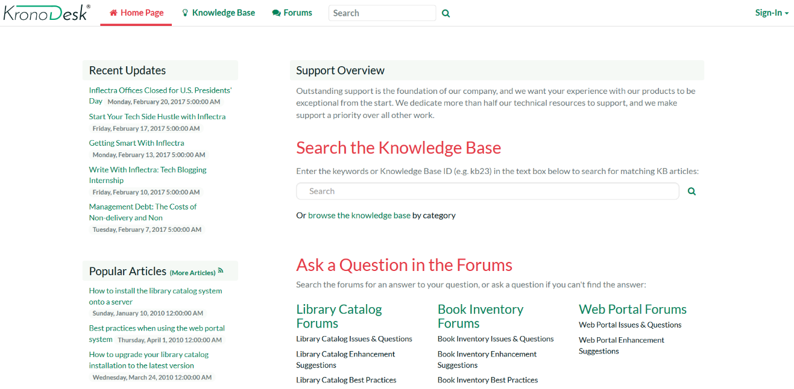
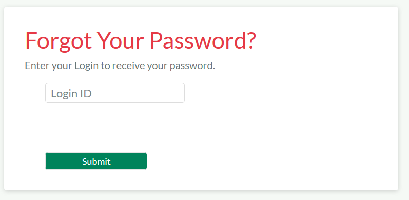

# Home Page

When you first access KronoDesk®, the system will default to displaying
either the Customer Home Page or the employee home page. The choice of
default home page depends on whether you are logged into the system and
if so, what role(s) your user belongs to. In either case, you can switch
from the Customer Home Page to the Employee Home Page by clicking the
link at the top of the page (assuming your user has permissions to see
the other page).

## Customer Home Page

When you first access the system without being logged-in, it will
display the public version of the customer home page illustrated below:

This version of the home page is neither personalized, nor customizable
and displays the following widgets:

-   **Support Overview** -- This widget walks you through the steps of
getting your support issue resolved. It provides a search box for
searching the online knowledge base, links to browse the support
forums and a message that you need to first log-in if you want to
submit a help desk ticket.

-   **Recent Forum Posts** -- This widget displays a list of the most
recent forum posts, including the name and date of the post.
Positioning the mouse over the title will display a popup tooltip
containing the long description of the post.

-   **Recent Updates** -- If enabled by the administrator, this will
display a list of recent news items from the company's website made
available by an RSS newsfeed. Positioning the mouse over the title
will display a popup tooltip containing the long description of the
news item.

-   **Popular Articles** -- This widget displays a list of the knowledge
base articles that have been most frequently viewed by users of the
system. Each article is displayed with its title and date of
publication. Positioning the mouse over the title will display a
popup tooltip containing the long description of the article.

-   **Recent Articles** - This widget displays a list of the most
recently submitted knowledge base articles that have been submitted
into the system. Each article is displayed with its title and date
of publication. Positioning the mouse over the title will display a
popup tooltip containing the long description of the article.

If you follow the instructions and login to the system with a basic user
account (i.e. a user that does not have the "customer" role such as
**ursulauser**), the dashboard will change to the basic authenticated
user home page illustrated below:

This version of the home page contains all the widgets in the public
version, with the following additions:

-   **Subscribed Threads** -- This widget displays a list of the support
forum threads that your user is currently subscribed to. This allows
you to keep track of specific topics that are of interest.

-   **Subscribed Articles** -- This widget displays a list of the
knowledge base articles that your user is currently subscribed to.
This allows you to keep track of specific topics that are of
interest.

If you login to the system with a Customer account (one that has the
role of customer, for example **chriscustomer**), you will get the
registered customer home page which is illustrated below:

This version of the home page contains all the widgets in the public
version, with the following additions:

-   **Support Overview** -- This widget includes all of the information
in the other versions of the home page, but it will also include
links for creating a new help desk ticket.

-   **Useful Links** -- This widget simply displays a list of useful
links that have been provided by the customer support agents.

-   **My Open Tickets** -- This widget displays a list of all the open
help desk tickets logged by your user. The list is displayed in
descending date-order. The list includes the name of the ticket, the
product it relates to, the status of the ticket and the customer
support agent it is assigned to (if any). Positioning the mouse over
the title will display the full description of the ticket, together
with any notes from the customer support agent.

## Employee Home Page

When you first access the system whilst logged-in as a customer support
agent (i.e. in the "Employee" role such as **ericemployee**), it will
display the employee home page illustrated below:

This dashboard is personalized to the current user and can also be
customized by clicking on either the "Modify Layout/Settings" or "Add
Items to Dashboard" hyperlink. By default, this home page includes the
following customer agent widgets:

-   **My Assigned Tickets** -- This widget displays a grid containing
the most recent open help desk tickets that have been assigned to
you. Each ticket is displayed along with the name of the product it
relates to, the customer who opened it, the date it was created, its
current status, and the date that it was last updated.

-   **Unassigned Tickets** -- The widget displays a grid containing the
most recent open help desk tickets that are not currently assigned
to any customer support agent. Each ticket is displayed along with
the name of the product it relates to, the customer who opened it,
the date it was created, its current status, and the date that it
was last updated.

-   **Recent Updates** -- If enabled by the administrator, this will
display a list of recent news items from the company's website made
available by an RSS newsfeed. Positioning the mouse over the title
will display a popup tooltip containing the long description of the
news item.

-   **Recent Forum Posts** -- This widget displays a list of the most
recent forum posts that have not yet been answered. The list
includes the name and date of the post, and positioning the mouse
over the title will display a popup tooltip containing the long
description of the post.

-   **Subscribed Threads** -- This widget displays a list of the support
forum threads that your user is currently subscribed to. This allows
you to keep track of specific topics that are of interest.

-   **Subscribed Articles** -- This widget displays a list of the
knowledge base articles that your user is currently subscribed to.
This allows you to keep track of specific topics that are of
interest.

As an employee or other internal user, you can click on the "Customer
Home Page" hyperlink to display the view of a customer in case you want
to see what they're currently seeing:

## Global Search

KronoDesk includes a global search bar that can be used to search across
products and artifact types for items that include the entered keywords
in either the name or description field:

You can narrow down the search results by clicking on the artifact
filters to limit the returned results to just forum threads, support
tickets or knowledge base articles:

## Register for New Account

When you click on the hyperlink to register a new account, the system
will display the following dialog:

You need to enter the following fields:

-   **Login ID** -- the username that you'd like to use in the system.
This has to be unique.

-   **Email Address** -- a valid email address that notifications will
be sent to.

-   **First Name** -- your first name

-   **Last Name** -- your last name

-   **Middle Initial** -- your middle initial (if applicable)

-   **Password** -- enter your desired password twice to ensure that you
have entered it correctly.

-   **Password Question/Answer** -- enter a question that only you will
know the answer to, together with the matching answer to that
question.

Once click the \[Create User\] button, the system will create a new user
in the system. Depending on how the administrator has configured the
system, you may get a welcome email that provides you with a copy of
your chosen login information.

## Sign-In to Account

When you click on the hyperlink to sign-in to an existing user account,
the following dialog is displayed:

You need to enter a valid login and password to access the system. If
you enter an incorrect login or password, the system will display a
validation message. If you fail to login successfully after five (5)
attempts, the system will lock your user account for ten (10) minutes.
This is to prevent brute-force attacks on the system.

### Reset Your Password

If you have forgotten your password, click on the "Forgot Your Password"
hyperlink which will display the following dialog:

To reset your password, you need to enter your login name and click the
"Submit" button. Then you'll be taken to the password question/answer
challenge screen:

You will be asked to provide the answer to your secret question. If you
successfully enter the correct password answer, the system will generate
a new random password and email it to you.

If for any reason you do not receive an email with your new password,
you need to contact the administrator of your installation to have them
manually reset your password.

