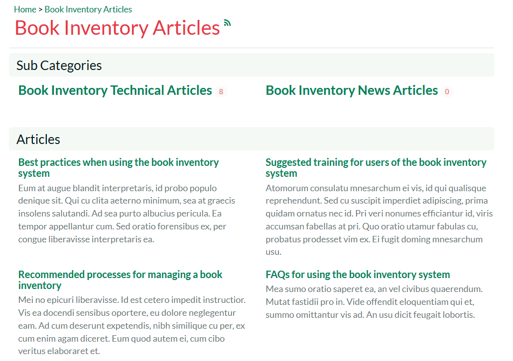
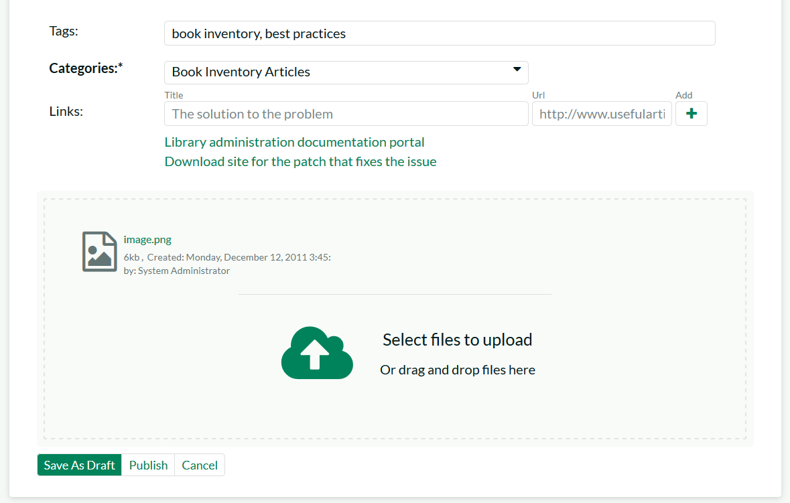

# Knowledge Base

The KronoDesk® online knowledge base provides the first level of support
to customers. Instead of having to constantly respond to the same
routine enquiries and support requests, customer support agents can use
the built-in knowledge base to create articles related to different
topics, categories and products. Knowledge base articles can be linked
to multiple categories and also tagged with meta-tags to make searching
easier by customers. The system includes full rich-text editor so that
articles can be formatted with lists, tables, different text styles and
embedded hyperlinks.

When a user starts entering a support ticket, KronoDesk automatically
scans the available KB articles to suggest a response before they submit
the ticket.

## Article List

When you click on the Knowledge Base option in the global navigation,
you will be taken to the main knowledge base page:

This page consists of list of article categories, with recent articles
and sub-categories displayed underneath. In addition, on the left-hand
side, there is a tag cloud that lets you find articles that use the
various tags.

### Category and Article List

The main section of the page will display a list of the article
categories and sub-categories, with the list of most recent articles
displayed underneath:

If you click on a specific category or sub-category, KronoDesk will
display the list of articles in the category, ordered by date:

If you click on the RSS icon, you can subscribe to the current category
in an RSS-compatible newsreader.

If you click on an article in the list, it will display the article
details page described in section 4.2.

### Tag Cloud

The tag cloud displays a list of all the tag names associated with
knowledge base articles in the system. The size and color of the font is
proportional to the number of articles associated with the tag.

Clicking on a tag name will display a page listing all of the articles
that use that tag:

## Article Details

When you click on the name of an article, the article details page is
displayed:

This page displays the following information:

-   **Article Breadcrumb** -- The breadcrumb list at the top of the page
displays the hierarchical list of categories and sub-categories that
the article belongs user. If you click on one of the categories, the
system will display of related articles in that category.

-   **Knowledge Base Article** -- This is the main part of the page and
displays the name, short description and long description of the
knowledge base article. If you click on the Subscription icon to the
right of the article title, the article will be added to your list
of subscribed knowledge base articles. Whenever a change is made to
the article, you will receive an email notification.

-   **Article Info** -- This information pane displays the unique ID
assigned to the article, the date it was last updated and the number
of times that it has been viewed.

-   **Tags** -- This pane displays a list of the meta-tags associated
with the current knowledge base article as well as an indication how
many other knowledge base articles have been tagged with the same
keywords. Clicking on the meta-tag name will automatically take you
back to the knowledge base list page with the filter set to the tag
name in question.

-   **Operations** -- This pane is only visible for customer support
agents and will display options for creating a new article, deleting
the current article or modifying the current article.

-   **Links** -- This section lets you see the links to related
information associated with the article

-   **Attachments** -- This section lets you view the documents and
screenshots attached to the current article.

### Editing an Article

Clicking on the operation to "Edit this Article" will display the edit
article screen:

You can change the name, description, body, tags and assigned categories
for the article. To include a screenshot in the article text, simple
paste in the image from the clipboard into the text editor and KronoDesk
will capture the image, attach it to the article and embed the image for
you:

In addition, you can edit the hyperlinks associated with the article and
attach documents to the article by simply dragging and dropping the file
onto the special upload control:

Once you are satisfied with your changes you can click either 'Save As
Draft' to save the KB article and keep in the draft status, or click
'Publish' to save the changes and publish as a live article that can be
searched on.

### Creating an Article

Clicking on the operation to "Create New Article" will display the new
article creation screen:

You need to enter the name, short description, body, tags and assigned
categories for the article. KronoDesk uses a rich text editor for the
description and body of the article so that you can enter formatted
text, programming code, hyperlinks, tables with ease.

To include a screenshot in the article text, simple paste in the image
from the clipboard into the text editor and KronoDesk will capture the
image, attach it to the article and embed the image for you:

To add hyperlinks to the article, simply enter the name and URL and
click the '+' button to add:

Finally, to attach a document to the article, you can either drag the
file onto the upload control or click on the button to browse to a file
on your local computer:

Once you are satisfied with your submission, you can click either 'Save
As Draft' to save the KB article and keep in the draft status, or click
'Publish' to save the changes and publish as a live article that can be
searched on.

