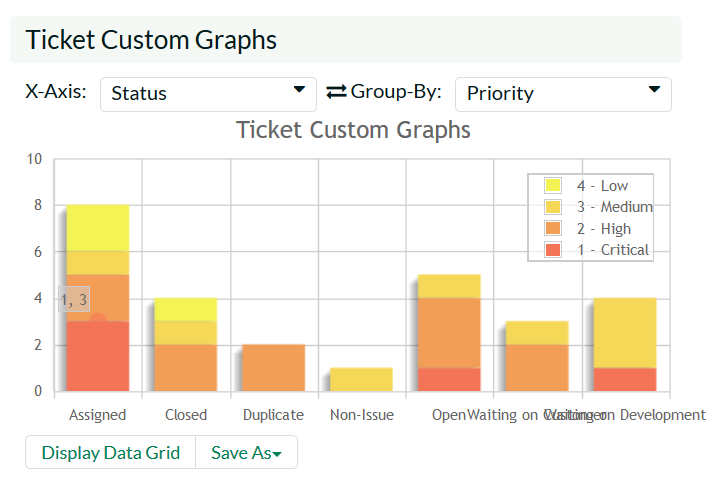
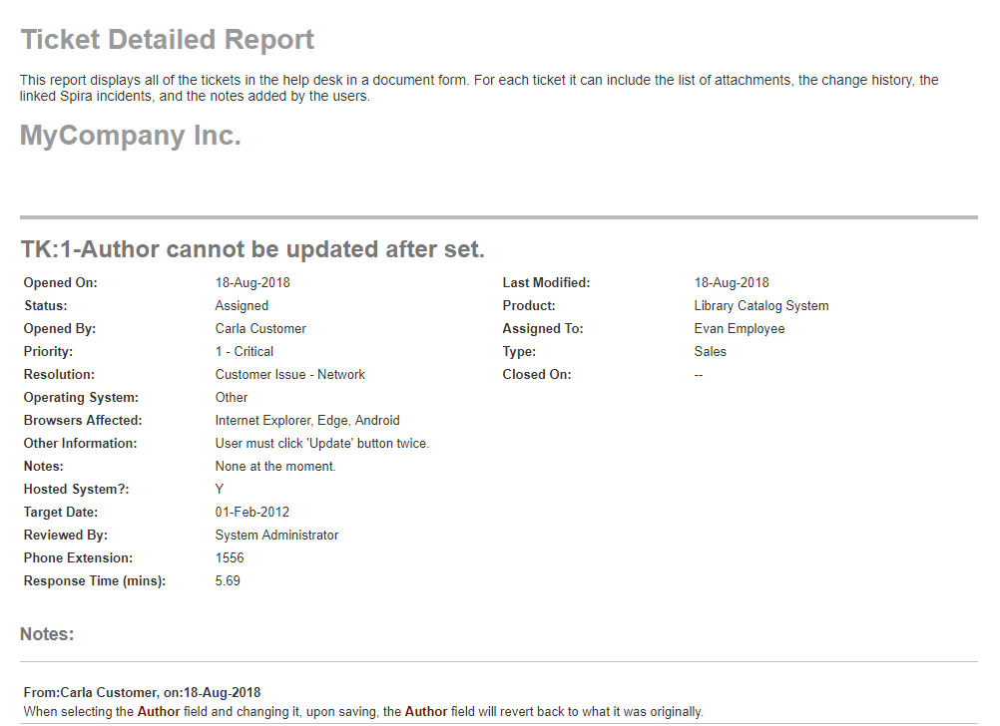

# Reports

This section describes the reporting features of KronoDesk®, including
an overview of each of the report types that are available. When you
click on the "Reports" tab on the global navigation bar, you will
initially be taken to the reports home page illustrated below:

The Reports page is a dashboard that contains links to a number of
reports, as well as a set of graphs. By default the dashboard will
display: the Ticket Progress Rate, Ticket Aging and Ticket Custom
Graphs.

Each of the graphs is described in more detail in the sub-sections
below:

## Ticket Progress Rate

The ticket progress rate chart displays the total number of tickets
created and closed over a particular date-range, either for all ticket
types and/or products or for a specific ticket type and/or product:

In this version of the report, the y-axis represents the number of
tickets (either created or closed in a 24 hour period), and the x-axis
represents a specific day in the time-span. Each data-point can be
viewed by positioning the mouse pointer over the point, and a "tooltip"
will pop-up listing the actual data value. You can filter the report by
the type of ticket and/or product, and also change the date range (e.g.
displaying only the infrastructure tickets for the date range). If you
choose a smaller date-range, the x-axis will switch from weekly to daily
and if you choose a larger date-range, the x-axis will switch to
monthly.

Clicking on the "Display Data Grid" link will display the underlying
data that is being used to generate the graph. In addition, clicking on
the Download Data as CSV link will export the datagrid into Comma
Separated Values (CSV) format that can be opened in MS-Excel. Some
browsers also support the ability to save the graph as an image file
(JPEG, PNG and GIF formats).

## Ticket Cumulative Count

The cumulative ticket count chart displays the cumulative total number
of tickets logged in the system over a particular date-range, either for
all ticket types and/or products or for a specific ticket type and/or
product. The report displays two data series, one illustrating the total
count of all ticjets, the other the total count of all *open tickets*
(i.e. with status not set to a closed status):

In this version of the report, the y-axis represents the number of
tickets, and the x-axis represents a specific week in the time-span.
Each data-point can be viewed by positioning the mouse pointer over the
point, and a "tooltip" will pop-up listing the actual data value. You
can also filter the type of ticket being reported, the product as well
as change the date interval. If you choose a smaller date-range, the
x-axis will switch from weekly to daily and if you choose a larger
date-range, the x-axis will switch to monthly.

Clicking on the "Display Data Grid" link will display the underlying
data that is being used to generate the graph. In addition, clicking on
the Download Data as CSV link will export the datagrid into Comma
Separated Values (CSV) format that can be opened in MS-Excel. Some
browsers also support the ability to save the graph as an image file
(JPEG, PNG and GIF formats).

## Ticket Open Count

The open ticket count chart displays the net number of open tickets in
the system over a particular date-range categorized by ticket priority,
either for all ticket types and/or products or for a specific ticket
type and/or product:

In this version of the report, the y-axis represents the number of
tickets, and the x-axis represents a specific week in the time-span. The
exact count of each bar in the stacked histogram can be viewed by
positioning the mouse pointer over the bar, and a "tooltip" will pop-up
listing the actual data value. You can also filter the type of ticket
being reported, the product the ticket was reported against, as well as
change the date interval. If you choose a smaller date-range, the x-axis
will switch from weekly to daily and if you choose a larger date-range,
the x-axis will switch to monthly.

Clicking on the "Display Data Grid" link will display the underlying
data that is being used to generate the graph. In addition, clicking on
the Download Data as CSV link will export the datagrid into Comma
Separated Values (CSV) format that can be opened in MS-Excel. Some
browsers also support the ability to save the graph as an image file
(JPEG, PNG and GIF formats).

## Ticket Aging

The ticket aging chart displays the number of days tickets have been
left open in the system. The chart is organized as a stacked histogram,
with the count of tickets on the y-axis and different age intervals on
the x-axis. Each bar-chart color represents a different ticket priority,
giving an IT service manager a snapshot view of the age of open tickets
by priority.

This report can be filtered by the type of ticket and/or product, so for
example you can see the aging of just support tickets, or just tickets
for a specific product.

Clicking on the "Display Data Grid" link will display the underlying
data that is being used to generate the graph. In addition, clicking on
the Download Data as CSV link will export the datagrid into Comma
Separated Values (CSV) format that can be opened in MS-Excel. Some
browsers also support the ability to save the graph as an image file
(JPEG, PNG and GIF formats).

## Ticket Turnaround Time

The incident turnaround time chart displays the number of days incidents
have taken to be closed (from the time they were first raised) in the
system. The chart is organized as a stacked histogram, with the count of
incidents on the y-axis and different turnaround time intervals on the
x-axis. Each bar-chart color represents a different incident priority,
giving a project manager a snapshot view of the turnaround time of
project incidents by priority.

This report can be filtered by the type of ticket and the product, so
for example you can see the turnaround time of just infrastructure
tickets, or just tickets for a specific product.

Clicking on the "Display Data Grid" link will display the underlying
data that is being used to generate the graph. In addition, clicking on
the Download Data as CSV link will export the datagrid into Comma
Separated Values (CSV) format that can be opened in MS-Excel. Some
browsers also support the ability to save the graph as an image file
(JPEG, PNG and GIF formats).

## Ticket Custom Graphs

The ticket custom graph widget shows how many tickets are currently in
the system. The number of tickets is displayed according to the criteria
that you specify. You can specify the type of data displayed along the
x-axis, and the ticket information that is used to group the data. When
you first open the graph you will be asked to pick the field that you
would like to display on the x-axis and the field that you would like to
group the data by. Once you have chosen the appropriate fields the graph
will be displayed:

In the illustration above, the x-axis represents the ticket status, and
the individual bars are grouped by the priority of the ticket. Each
data-value can be viewed by positioning the mouse pointer over the bar,
and a "tooltip" will pop-up listing the actual data value. Clicking on
the "Display Data Grid" link will display the underlying data that is
being used to generate the graph. In addition, clicking on the Download
Data as CSV link will export the datagrid into Comma Separated Values
(CSV) format that can be opened in MS-Excel. Some browsers also support
the ability to save the graph as an image file (JPEG, PNG and GIF
formats).

## Reports

Kronodesk has nine different reports covering the help desk, knowledge
base, organizations, and users. Each report can be exported in a number
of different formats, including PDF, Word, and Excel. Each report can
also be filtered by a number of different fields and sorted by a
particular field as well. These features make it easy to quickly
generate a report to explore a subset of all the data in the system.

For example, you can create a report showing all tickets in the last six
months for one product that have been resolved. Below is a report
configuration page to illustrate the exporting, filtering, and sorting
options available. Here we are looking at the Ticket Details report.

To create the report, configure the options as required, then click
"Create Report". The report will then be dynamically created live. To
view the report follow the onscreen instructions.

The first part of the report generated may look something like that
below in HTML format:

